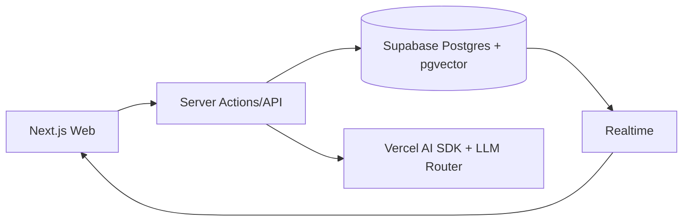

# 后端架构文档

## 架构概述

后端采用 Next.js Server Actions + Supabase 的架构模式，提供 RESTful API 和实时功能。

## 架构图

## 核心组件

### Server Actions
- 写操作入口
- 权限检查
- 参数验证
- 业务逻辑处理

### API Routes
- 读操作入口
- 数据查询
- 分页处理
- 过滤处理

### Supabase
- PostgreSQL 数据库
- pgvector 向量检索
- Auth 认证
- Storage 存储
- Realtime 实时更新

### AI Service
- LLM Router
- Prompt Builder
- RAG Retrieval
- Streaming Response

## 数据流程

### 写操作流程
1. 前端调用 Server Action
2. Server Action 验证参数
3. Server Action 检查权限
4. Server Action 执行业务逻辑
5. Server Action 写入数据库
6. Server Action 返回响应

### 读操作流程
1. 前端调用 API Route
2. API Route 检查权限
3. API Route 查询数据库
4. API Route 处理响应（分页、过滤）
5. API Route 返回响应

### AI 请求流程
1. 前端调用 AI Server Action
2. Server Action 路由到合适的模型
3. Server Action 构建 Prompt
4. Server Action 检索知识库
5. Server Action 调用 LLM
6. Server Action 返回流式响应

## 安全架构

### 认证
- Supabase Auth
- JWT Token
- Session Cookie

### 授权
- RBAC（基于角色的访问控制）
- RLS（行级安全性）
- 最小权限原则

### 数据保护
- 敏感数据加密存储
- 敏感数据脱敏输出
- 审计日志记录

## 性能优化

### 缓存策略
- Redis 缓存热点数据
- HTTP 缓存
- React Query 客户端缓存

### 数据库优化
- 索引优化
- 查询优化
- 连接池管理

### 异步处理
- 消息队列处理异步任务
- 实时更新使用 WebSocket

## 部署架构

### 开发环境
- 本地 Next.js 开发服务器
- 本地 Supabase 实例

### 测试环境
- Vercel Preview 部署
- Supabase Staging 实例

### 生产环境
- Vercel 生产部署
- Supabase Production 实例

## 监控与运维

### 监控指标
- API 请求次数
- API 响应时间
- 数据库查询时间
- AI 请求次数和耗时

### 告警配置
- API 错误率告警
- 数据库连接数告警
- AI 请求超时告警

### 日志管理
- 结构化日志
- 请求追踪
- 错误分析