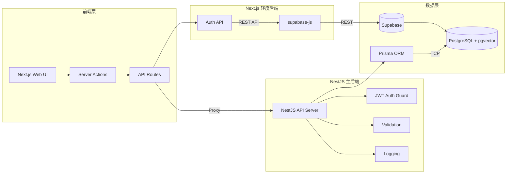
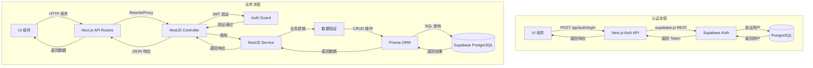

# 后端架构文档

## 架构概述

后端采用 **NestJS（主后端）+ Next.js（轻度后端）** 的架构模式：
- **Next.js 轻度后端**：负责认证接口（登录/注册）、SSR/SSG 渲染、API 代理，通过 `supabase-js` 库直接调用 Supabase REST API
- **NestJS 主后端**：负责复杂业务逻辑、数据管理，使用 Prisma ORM 通过 TCP 连接访问 Supabase PostgreSQL

## 架构图



## 完整数据流图



## 核心组件

### NestJS 主后端

#### Controller（控制器）
- API 入口点
- 路由定义
- 请求参数接收
- 响应返回

#### Service（服务）
- 业务逻辑处理
- 数据转换
- 事务管理
- 第三方服务调用

#### Module（模块）
- 组织相关组件
- 依赖注入配置
- 模块化开发

#### Middleware（中间件）
- 请求处理管道
- 认证授权
- 日志记录
- CORS 处理

### Next.js 轻度后端

#### API Routes
- 代理请求到 NestJS
- 处理轻量级业务逻辑
- SSR/SSG 数据预取

#### Server Actions
- 表单提交处理
- 轻量级写操作
- 服务端状态管理

### Prisma ORM
- 类型安全的数据库访问
- 数据模型定义
- 迁移管理
- 查询构建器

### Supabase
- PostgreSQL 数据库托管
- pgvector 向量检索
- Auth 认证服务
- Storage 文件存储
- Realtime 实时更新

## 数据流程

### 写操作流程
1. 前端发起请求到 Next.js API Routes
2. API Routes 将请求代理到 NestJS Controller
3. Controller 验证请求参数
4. Controller 调用 Service 处理业务逻辑
5. Service 使用 Prisma ORM 写入数据库
6. Prisma 执行 SQL 写入 Supabase PostgreSQL
7. 返回响应到前端

### 读操作流程
1. 前端发起请求到 Next.js API Routes
2. API Routes 将请求代理到 NestJS Controller
3. Controller 调用 Service 查询数据
4. Service 使用 Prisma ORM 查询数据库
5. Prisma 执行 SQL 查询 Supabase PostgreSQL
6. 返回查询结果到前端

### 认证流程
1. 前端调用 `/api/auth/login`
2. Next.js 代理到 NestJS Auth Controller
3. Auth Controller 调用 Auth Service
4. Auth Service 验证用户凭证
5. Auth Service 生成 JWT Token
6. 返回 Token 和用户信息到前端
7. 前端存储 Token，后续请求携带 Authorization Header

### AI 请求流程
1. 前端调用 AI Server Action
2. Server Action 使用 Vercel AI SDK
3. AI SDK 路由到合适的 LLM 模型
4. 构建 Prompt（可能包含数据库查询）
5. 调用 LLM API
6. 返回流式响应到前端

## 安全架构

### 认证
- JWT Token 认证
- Session Cookie 存储
- Supabase Auth 集成

### 授权
- RBAC（基于角色的访问控制）
- 守卫（Guard）验证权限
- 最小权限原则

### 数据保护
- 敏感数据加密存储
- 敏感数据脱敏输出
- 审计日志记录
- 请求参数验证

## 性能优化

### 缓存策略
- Redis 缓存热点数据
- HTTP 缓存
- React Query 客户端缓存

### 数据库优化
- 索引优化
- 查询优化
- 连接池管理

### 异步处理
- 消息队列处理异步任务
- 实时更新使用 WebSocket

## 部署架构

### 开发环境
- 本地 Next.js 开发服务器（端口 3000）
- 本地 NestJS 开发服务器（端口 3001）
- Supabase Local 实例或远程开发数据库

### 测试环境
- Vercel Preview 部署（Next.js）
- NestJS 测试服务器
- Supabase Staging 实例

### 生产环境
- Vercel 生产部署（Next.js）
- Render/AWS EC2 部署（NestJS）
- Supabase Production 实例

## 项目结构

```
apps/api/                              # NestJS 后端应用
├── src/
│   ├── main.ts                        # 应用入口
│   ├── app.module.ts                  # 根模块
│   └── modules/                       # 功能模块
│       ├── auth/                      # 认证模块
│       │   ├── auth.controller.ts     # 认证控制器
│       │   ├── auth.service.ts        # 认证服务
│       │   ├── auth.module.ts         # 认证模块
│       │   ├── jwt.strategy.ts        # JWT 策略
│       │   └── dto/                   # 数据传输对象
│       │       └── login.dto.ts
│       ├── patient/                   # 患者模块
│       │   ├── patient.controller.ts
│       │   ├── patient.service.ts
│       │   ├── patient.module.ts
│       │   └── dto/
│       │       └── create-patient.dto.ts
│       └── prisma/                    # Prisma 模块
│           ├── prisma.module.ts
│           └── prisma.service.ts
├── prisma/
│   └── schema.prisma                  # Prisma 数据模型
├── .env.example                       # 环境变量模板
├── package.json
├── tsconfig.json
└── nest-cli.json
```

## 监控与运维

### 监控指标
- API 请求次数
- API 响应时间
- 数据库查询时间
- AI 请求次数和耗时

### 告警配置
- API 错误率告警
- 数据库连接数告警
- AI 请求超时告警

### 日志管理
- 结构化日志
- 请求追踪
- 错误分析
