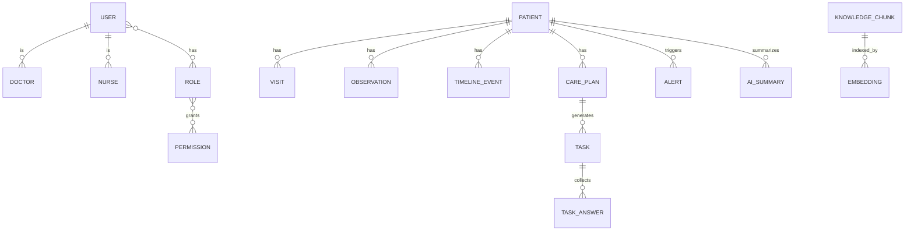

# 数据库架构文档

## 数据库概述

数据库采用 PostgreSQL + pgvector 的架构模式，支持事务一致性、向量检索与实时事件。

## ER 图

## 表结构

### 用户相关表
- user：用户基础信息
- doctor：医生信息
- nurse：护士信息
- role：角色信息
- permission：权限信息
- role_permissions：角色权限关联
- user_roles：用户角色关联

### 患者相关表
- patient：患者信息
- visit：就诊记录
- observation：观测数据

### Care Plan 相关表
- care_plan：照护计划
- task：任务
- task_answer：任务回答

### 时间线相关表
- timeline_event：时间线事件

### 告警相关表
- alert：告警信息

### AI 相关表
- ai_summary：AI 摘要
- knowledge_chunk：知识分片
- embedding：向量

## 索引策略

### 主键索引
- 所有表的 id 字段

### 外键索引
- 所有外键字段

### 复合索引
- patient: org_id + risk_level
- visit: patient_id + visited_at
- timeline_event: patient_id + event_at
- task: assignee_user_id + status

### 向量索引
- embedding: ivfflat (vector)

## RLS 策略

### 用户表 RLS
- 用户只能访问自己的记录
- 管理员可以访问所有用户

### 患者表 RLS
- 用户只能访问所属机构的患者
- 医生可以访问自己管理的患者
- 护士可以访问自己负责的患者

### Care Plan 表 RLS
- 用户只能访问所属机构的照护计划
- 医生可以访问自己创建的照护计划

### 任务表 RLS
- 用户只能访问自己的任务
- 管理员可以访问所有任务

## 数据迁移

### 迁移工具
- Supabase CLI
- 迁移脚本版本控制

### 迁移规范
- 迁移脚本按顺序编号
- 迁移脚本幂等性
- 迁移前备份数据
- 迁移后验证数据

## 数据安全

### 敏感数据
- 患者个人信息加密存储
- 密码使用 bcrypt 哈希
- 日志中不记录敏感信息

### 访问控制
- RLS 行级安全性
- 最小权限原则
- 审计日志

### 数据备份
- 定期自动备份
- 备份加密存储
- 测试备份恢复

## 性能优化

### 查询优化
- 使用索引优化查询
- 避免全表扫描
- 使用覆盖索引
- 限制查询结果数量

### 数据库配置
- 调整连接池大小
- 调整内存分配
- 调整 WAL 配置

### 数据归档
- 定期归档历史数据
- 使用分区表
- 使用只读副本

## 监控与运维

### 性能监控
- 查询性能监控
- 连接数监控
- 磁盘使用监控

### 告警配置
- 查询超时告警
- 磁盘空间告警
- 连接数告警

### 日志管理
- 慢查询日志
- 错误日志
- 审计日志