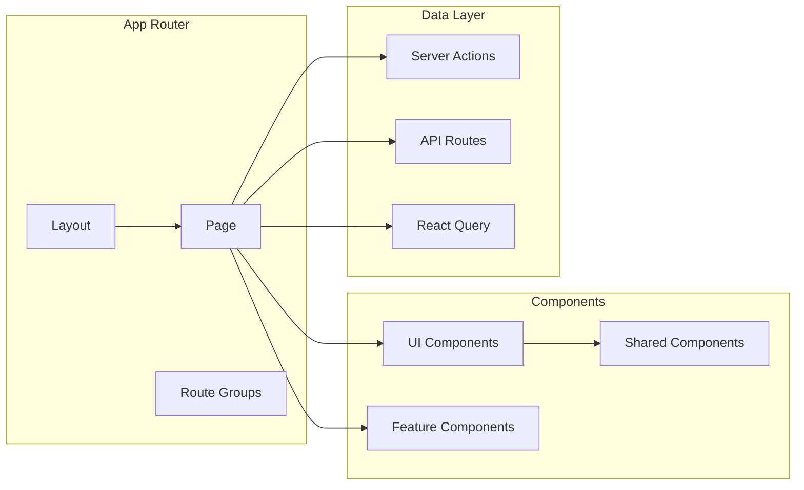

# 前端架构文档

## 架构概述

前端采用 Next.js App Router + React 19 的架构模式，使用 shadcn/ui 组件库和 Tailwind CSS 4 进行样式开发。

## 架构图



## 目录结构

### App Router 结构
```
app/
  (auth)/                 # 认证路由组
    login/
      page.tsx
  (dashboard)/            # 工作台路由组
    patients/
      [id]/
        page.tsx
      page.tsx
    care-plans/
      page.tsx
  layout.tsx
  page.tsx
```

### Feature 结构
```
features/
  patient/
    components/           # UI 组件
    actions/              # Server Actions
    queries/              # 数据查询
    schemas/              # 数据验证
    types/                # 类型定义
    hooks/                # 自定义 hooks
```

### Shared Components
```
components/
  ui/                     # shadcn/ui 组件
  layout/                 # 布局组件
  common/                 # 通用组件
```

## 核心组件

### Layout 组件
- AppShell：应用外壳
- Sidebar：侧边栏导航
- Header：顶部导航
- Footer：页脚

### Page 组件
- Dashboard：首页仪表盘
- PatientList：患者列表
- PatientDetail：患者详情
- CarePlan：照护计划
- TaskList：任务列表
- AIChat：AI 聊天

### UI Components
- Button：按钮
- Input：输入框
- Card：卡片
- Table：表格
- Modal：弹窗
- Badge：徽章

## 状态管理

### 服务端状态
- React Query：管理服务端状态缓存
- Server Actions：写操作入口
- API Routes：读操作入口

### 客户端状态
- useState/useReducer：组件局部状态
- Context API：全局客户端状态

### URL 状态
- Search Params：列表筛选、分页状态
- Route Params：页面级状态

## 数据流程

### 数据获取流程
1. Page 组件调用 React Query
2. React Query 调用 API Route 或 Server Action
3. API Route 查询数据库
4. 返回数据给 React Query
5. React Query 更新缓存
6. 组件重新渲染

### 数据更新流程
1. 组件调用 Server Action
2. Server Action 验证参数
3. Server Action 检查权限
4. Server Action 更新数据库
5. Server Action 返回结果
6. React Query 失效缓存
7. 组件重新获取数据

## 性能优化

### 加载优化
- Server Components：服务端渲染
- 代码分割：按需加载
- 图片优化：Next.js Image
- 字体优化：font-display: swap

### 渲染优化
- React.memo：避免不必要的重渲染
- useMemo/useCallback：优化计算和回调
- 虚拟滚动：大数据列表优化

### 缓存优化
- React Query：服务端状态缓存
- HTTP 缓存：静态资源缓存
- CDN：内容分发网络

## 安全架构

### 认证
- Supabase Auth
- Session Cookie
- 权限守卫

### 输入验证
- Zod Schema
- 防止 XSS 攻击
- 防止 CSRF 攻击

### 数据保护
- 敏感数据脱敏
- 安全的 Cookie 属性
- CSP 配置

## 测试策略

### 单元测试
- 组件测试
- 工具函数测试
- 数据验证测试

### 集成测试
- 页面测试
- 功能测试
- API 测试

### E2E 测试
- 端到端流程测试
- 用户交互测试
- 跨页面测试

## 部署架构

### 开发环境
- 本地 Next.js 开发服务器
- 热重载

### 测试环境
- Vercel Preview 部署
- 预览 URL

### 生产环境
- Vercel 生产部署
- 自动扩展
- CDN 加速