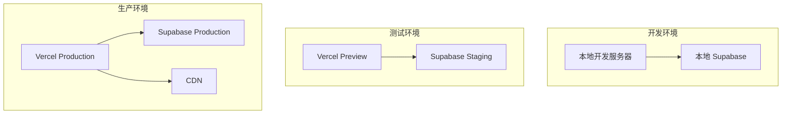

# 基础设施文档

## 基础设施概述

项目使用 Vercel + Supabase 作为基础设施平台，支持开发、测试、生产三个环境。

## 基础设施架构图

## 部署平台

### Vercel
- 前端部署平台
- 自动构建和部署
- 预览环境
- 生产环境

### Supabase
- 后端服务平台
- PostgreSQL 数据库
- Auth 认证
- Storage 存储
- Realtime 实时更新

## 环境配置

### 开发环境
- URL：http://localhost:3000
- 数据库：本地 Supabase
- 配置：.env.local

### 测试环境
- URL：Vercel Preview URL
- 数据库：Supabase Staging
- 配置：Vercel Environment Variables

### 生产环境
- URL：生产域名
- 数据库：Supabase Production
- 配置：Vercel Environment Variables

## CI/CD 流程

### 持续集成

### 持续部署

## 基础设施安全

### 网络安全
- HTTPS 加密传输
- TLS 1.2+
- HSTS 配置

### 数据安全
- 数据加密存储
- 备份策略
- 访问控制

### 访问安全
- 最小权限原则
- 密钥管理
- 审计日志

## 监控与运维

### 性能监控
- Vercel Analytics
- Supabase Analytics
- 自定义指标

### 错误监控
- Sentry
- 错误日志
- 告警通知

### 日志管理
- Vercel Logs
- Supabase Logs
- 日志分析

## 基础设施成本

### Vercel 成本
- 免费层：适合开发
- Pro 层：适合生产

### Supabase 成本
- 免费层：适合开发
- Pro 层：适合生产

### 优化策略
- 监控资源使用
- 优化数据库查询
- 使用缓存减少请求

## 基础设施扩展

### 水平扩展
- Vercel 自动扩展
- Supabase 数据库扩展

### 垂直扩展
- 增加服务器资源
- 升级数据库配置

### 功能扩展
- 添加新的服务
- 集成第三方服务

## 灾难恢复

### 备份策略
- 定期数据库备份
- 配置备份
- 代码版本控制

### 恢复流程
- 测试备份恢复
- 恢复数据
- 验证服务

### RTO/RPO
- RTO：15 分钟
- RPO：1 小时