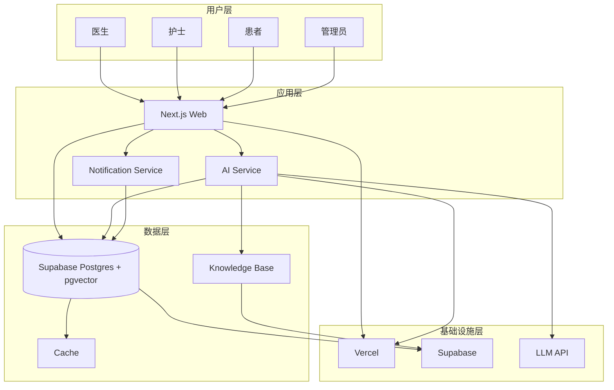
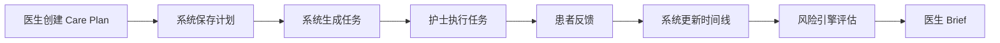
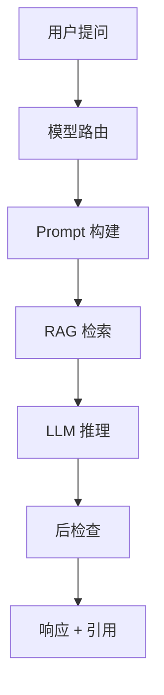

# 系统架构文档

## 系统概述

Doctor Copilot 是面向院外连续医疗照护场景的 AI Care Platform，服务医生、护士、患者与管理员四类角色。

## 系统架构图

## 系统核心流程

### Care Plan 流程

### AI Chat 流程

## 系统边界

### 系统内边界
- 认证服务边界
- 权限服务边界
- 数据服务边界
- AI 服务边界

### 系统外边界
- 用户界面边界
- 第三方 API 边界
- 数据存储边界
- 外部集成边界

## 非功能需求

### 性能
- API 响应时间 < 200ms
- 页面加载时间 < 1s
- AI 响应时间 < 5s

### 可用性
- 系统可用性 > 99.9%
- 数据备份周期 < 1h
- 故障恢复时间 < 15min

### 安全性
- 数据加密传输
- 数据加密存储
- 访问审计日志

### 可扩展性
- 支持水平扩展
- 支持功能扩展
- 支持第三方集成

## 技术栈

### 前端
- Next.js 15+
- React 19
- TypeScript
- shadcn/ui
- Tailwind CSS 4

### 后端
- Next.js Server Actions
- Supabase
- PostgreSQL + pgvector
- Vercel AI SDK

### 部署
- Vercel
- Supabase

## 系统模块

### 核心模块
- 认证模块
- 患者管理模块
- Care Plan 模块
- Task 模块
- 时间线模块
- 告警模块
- AI Chat 模块

### 辅助模块
- 权限管理模块
- 消息通知模块
- 知识库模块
- 配置管理模块

## 数据模型

### 核心实体
- User（用户）
- Patient（患者）
- Doctor（医生）
- Nurse（护士）
- Care Plan（照护计划）
- Task（任务）
- Timeline Event（时间线事件）
- Alert（告警）

### AI 相关实体
- AI Summary（AI 摘要）
- Knowledge Chunk（知识分片）
- Embedding（向量）

## 安全架构

### 认证机制
- SSO 单点登录
- Supabase Auth
- JWT Token

### 授权机制
- RBAC 基于角色的访问控制
- RLS 行级安全性
- 权限声明

### 数据保护
- 敏感数据加密
- 数据脱敏
- 访问审计

## 监控与运维

### 监控指标
- 系统性能指标
- 用户行为指标
- 业务运营指标

### 告警机制
- 阈值告警
- 异常检测
- 自动恢复

### 日志管理
- 结构化日志
- 日志分析
- 日志归档