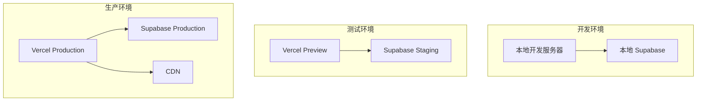

# 部署环境文档

## 环境概述

部署环境使用 Vercel + Supabase，支持开发、测试、生产三个环境。

## 环境架构

## 部署流程

### 开发环境部署
1. 安装依赖
2. 配置环境变量
3. 启动本地 Supabase
4. 启动开发服务器

### 测试环境部署
1. 推送代码到 GitHub
2. 创建 PR
3. Vercel 自动构建预览环境
4. 手动验证

### 生产环境部署
1. 合并 PR 到 main 分支
2. Vercel 自动构建生产环境
3. 验证生产环境
4. 监控运行状态

## 部署配置

### Vercel 配置
- Framework: Next.js
- Build Command: pnpm build
- Output Directory: .next
- Environment Variables

### Supabase 配置
- 创建项目
- 配置 Auth
- 配置 Storage
- 配置 Realtime

## 环境变量管理

### 开发环境
- .env.local 文件
- 本地环境变量

### 测试环境
- Vercel Environment Variables
- Staging 环境变量

### 生产环境
- Vercel Environment Variables
- Production 环境变量

## 数据库迁移

### 迁移流程
1. 创建迁移脚本
2. 测试迁移脚本
3. 应用迁移到测试环境
4. 应用迁移到生产环境

### 迁移工具
- Supabase CLI
- 迁移脚本版本控制

## 部署检查清单

### 部署前检查
- 代码审查通过
- 测试通过
- 构建成功
- 环境变量配置正确

### 部署后检查
- 服务可用性
- 功能验证
- 性能监控
- 错误日志

## 回滚流程

### 回滚步骤
1. 确认需要回滚
2. 选择回滚版本
3. 执行回滚
4. 验证回滚结果

### 回滚策略
- 使用 Git 回滚
- 使用 Vercel 回滚
- 使用数据库迁移回滚

## 监控与告警

### 监控指标
- API 请求次数
- API 响应时间
- 数据库查询时间
- AI 请求次数和耗时

### 告警配置
- API 错误率告警
- 数据库连接数告警
- AI 请求超时告警

### 日志管理
- Vercel Logs
- Supabase Logs
- 错误分析

## 性能优化

### 前端优化
- 代码分割
- 图片优化
- 字体优化
- 缓存策略

### 后端优化
- 数据库索引
- 查询优化
- 缓存策略
- 连接池管理

## 安全配置

### HTTPS
- 启用 HTTPS
- 使用有效的 SSL 证书
- 强制 HTTPS 重定向

### TLS 配置
- 使用 TLS 1.2+
- 禁用弱密码套件
- 配置 HSTS 头

### CORS 配置
- 限制允许的来源
- 限制允许的方法
- 限制允许的头部