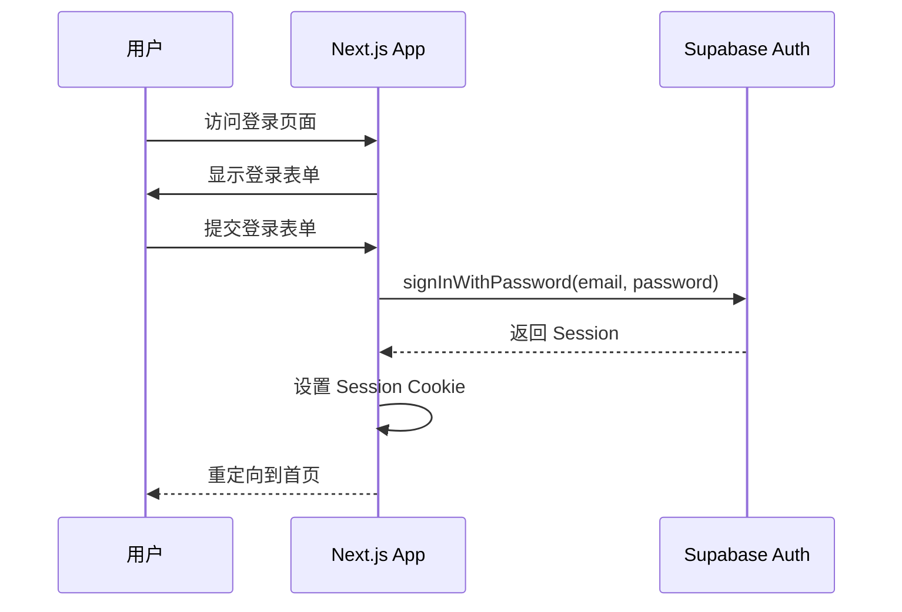
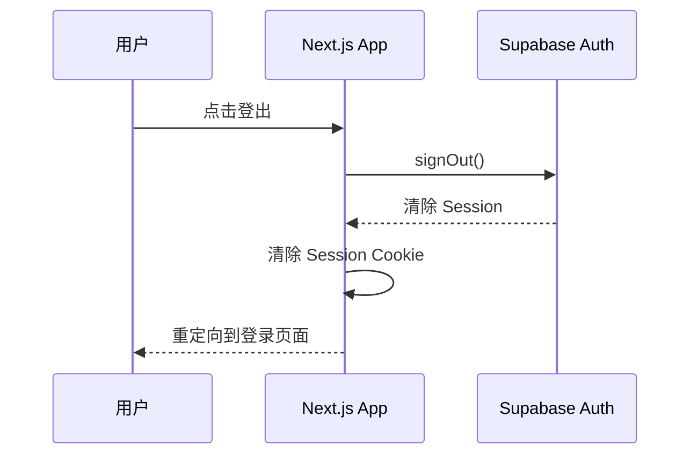
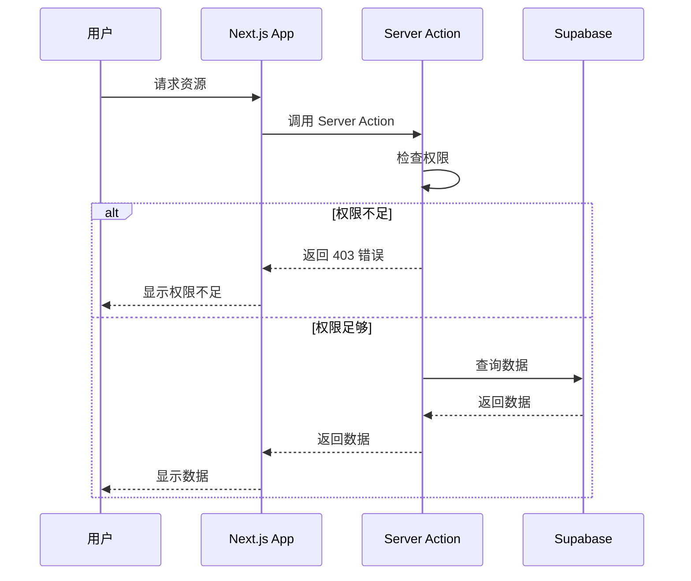

# 认证模块文档

## 模块概述

认证模块负责用户身份验证和授权管理，使用 Supabase Auth 实现。

## 认证流程

### 登录流程

### 登出流程

## 认证方式

### 用户名密码认证
- 邮箱 + 密码
- 注册、登录、忘记密码

### SSO 认证
- OAuth 2.0
- Google、GitHub、Microsoft
- SAML（企业级）

### 多因素认证
- TOTP
- 短信验证
- 邮件验证

## 授权机制

### RBAC（基于角色的访问控制）
- 角色定义：doctor、nurse、admin、patient
- 权限定义：read、write、delete
- 角色分配权限
- 用户分配角色

### RLS（行级安全性）
- 所有表启用 RLS
- 使用 org_id + role_claim 作为策略核心
- 用户只能访问所属机构的数据
- 用户只能访问有权限的数据

### 权限检查流程

## Session 管理

### Session 创建
- 登录成功后创建 Session
- Session 包含用户信息和权限
- Session 存储在 Cookie 中

### Session 验证
- 每次请求验证 Session
- Session 过期自动刷新
- Session 无效重定向到登录页面

### Session 清除
- 登出时清除 Session
- Session 过期自动清除
- 用户删除时清除 Session

## 密码安全

### 密码策略
- 最小长度：8 位
- 包含大小写字母
- 包含数字
- 包含特殊字符

### 密码存储
- 使用 bcrypt 哈希
- 盐值随机生成
- 不存储明文密码

### 密码重置
- 发送重置链接到邮箱
- 重置链接有效期 1 小时
- 重置后需要重新登录

## 安全措施

### 防止暴力攻击
- 登录失败次数限制
- 登录失败后锁定账户
- 验证码验证

### 防止会话劫持
- 使用 HttpOnly Cookie
- 使用 Secure Cookie
- 使用 SameSite Cookie

### 防止 CSRF 攻击
- 使用 CSRF Token
- 验证请求来源
- 使用 SameSite Cookie

## 错误处理

### 认证错误
- 未认证：返回 401
- 认证过期：返回 401
- Token 无效：返回 401

### 授权错误
- 权限不足：返回 403
- 访问被拒绝：返回 403

### 通用错误
- 服务器错误：返回 500
- 参数错误：返回 400

## 测试策略

### 单元测试
- 测试密码哈希
- 测试权限检查
- 测试 Session 验证

### 集成测试
- 测试登录流程
- 测试登出流程
- 测试权限控制

### E2E 测试
- 测试完整认证流程
- 测试权限边界
- 测试错误场景