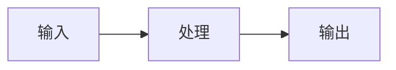

# 实现文档模板

## 1. 概述

### 1.1 功能描述
简要描述本实现的功能目标。

### 1.2 需求来源
引用相关的 PRD 或需求文档。

### 1.3 相关文档
| 文档 | 链接 |
|---|---|
| PRD | [链接](./) |
| API 设计 | [链接](./) |
| 数据库设计 | [链接](./) |

## 2. 技术方案

### 2.1 架构设计
描述本功能的架构设计，包含架构图。



### 2.2 模块划分
描述本功能的模块划分和职责。

| 模块 | 职责 |
|---|---|
| 模块 1 | 职责描述 |
| 模块 2 | 职责描述 |

### 2.3 目录结构
描述本功能的目录结构。

```
features/
  feature-name/
    components/           # UI 组件
    actions/              # Server Actions
    queries/              # 数据查询
    schemas/              # 数据验证
    types/                # 类型定义
    hooks/                # 自定义 hooks
```

## 3. API 设计

### 3.1 接口列表
描述本功能涉及的 API 接口。

| 方法 | 路径 | 描述 |
|---|---|---|
| GET | /api/resource | 获取资源列表 |
| POST | /api/resource | 创建资源 |
| PUT | /api/resource/{id} | 更新资源 |
| DELETE | /api/resource/{id} | 删除资源 |

### 3.2 请求格式
描述请求参数和格式。

```json
{
  "field1": "value1",
  "field2": "value2"
}
```

### 3.3 响应格式
描述响应格式。

```json
{
  "data": {},
  "meta": {}
}
```

## 4. 数据库设计

### 4.1 表结构
描述涉及的数据库表结构。

| 字段 | 类型 | 约束 | 说明 |
|---|---|---|---|
| id | uuid | PK | 主键 |
| field1 | text | NOT NULL | 字段说明 |

### 4.2 索引策略
描述索引策略。

| 索引名称 | 字段 | 类型 |
|---|---|---|
| idx_field1 | field1 | BTREE |

### 4.3 RLS 策略
描述 RLS 策略。

```sql
CREATE POLICY "Users can access their own data" ON table_name
  FOR SELECT USING (auth.uid() = user_id);
```

## 5. 安全设计

### 5.1 权限控制
描述权限控制策略。

| 角色 | 权限 |
|---|---|
| doctor | read, write |
| nurse | read |

### 5.2 输入验证
描述输入验证策略。

```typescript
const schema = z.object({
  field1: z.string().min(1),
  field2: z.number().positive()
});
```

### 5.3 数据保护
描述数据保护策略。

## 6. 测试方案

### 6.1 测试用例
描述测试用例。

| 测试场景 | 预期结果 |
|---|---|
| 场景 1 | 结果描述 |
| 场景 2 | 结果描述 |

### 6.2 测试工具
描述使用的测试工具。

## 7. 部署方案

### 7.1 部署步骤
描述部署步骤。

### 7.2 配置变更
描述配置变更。

### 7.3 回滚方案
描述回滚方案。

## 8. 风险评估

| 风险 | 影响 | 缓解措施 |
|---|---|---|
| 风险 1 | 影响描述 | 缓解措施 |
| 风险 2 | 影响描述 | 缓解措施 |