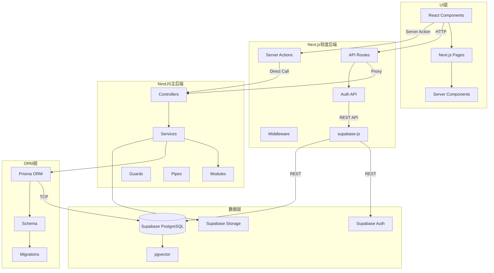
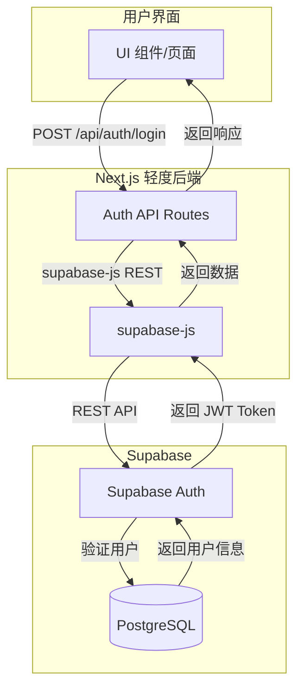
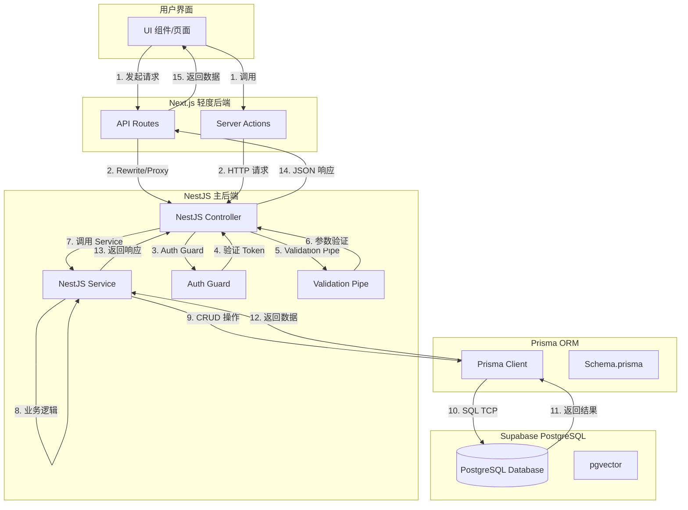
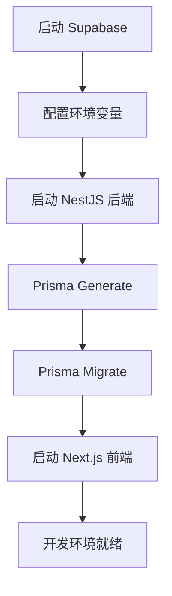
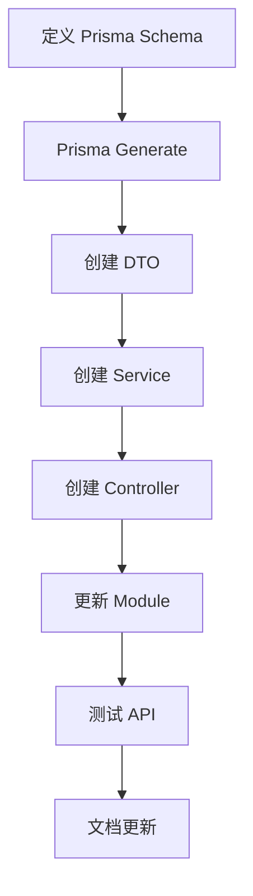

# 全栈工作流程文档

## 概述

本文档定义了 Doctor Copilot 项目的完整全栈工作流程，从 UI 层到数据库层的完整数据流向和开发流程。

## 架构分层



## 完整数据流向

### 认证流程图（登录/注册）



### 业务流程图（CRUD 操作）



### 各层职责说明

| 层级 | 技术 | 职责 |
|---|---|---|
| UI 层 | React + Next.js | 用户界面渲染、交互逻辑、状态管理 |
| Next.js 轻度后端 | API Routes + Server Actions + supabase-js | 认证接口（登录/注册）、请求代理、SSR/SSG 数据预取、通过 REST API 访问 Supabase |
| NestJS 主后端 | NestJS Framework | 复杂业务逻辑、JWT 权限验证、API 管理、事务处理、通过 TCP 连接访问数据库 |
| ORM 层 | Prisma | 类型安全数据库访问（TCP 连接）、数据模型定义、迁移管理 |
| 数据层 | Supabase PostgreSQL | 关系型数据存储、向量检索、认证服务、文件存储 |

## 开发工作流程

### 开发环境启动流程



### 详细步骤

#### 1. 启动 Supabase
```bash
# 使用 Supabase CLI 启动本地实例
supabase start

# 或者配置远程开发数据库
# 修改 apps/api/.env 中的 DATABASE_URL
```

#### 2. 启动 NestJS 后端
```bash
cd apps/api

# 安装依赖
pnpm install

# 生成 Prisma 客户端
pnpm prisma:generate

# 运行数据库迁移
pnpm prisma:migrate

# 启动开发服务器
pnpm dev
```

#### 3. 启动 Next.js 前端
```bash
cd /Users/allure/Desktop/doctor-copilot

# 安装依赖
pnpm install

# 启动开发服务器
pnpm dev
```

### API 开发流程

#### 新建 API 接口流程



#### 详细步骤

1. **定义 Prisma Schema**
   - 修改 `apps/api/prisma/schema.prisma`
   - 添加新的数据模型或字段

2. **生成 Prisma 客户端**
   ```bash
   cd apps/api
   pnpm prisma:generate
   ```

3. **创建 DTO（数据传输对象）**
   - 在模块的 `dto/` 目录下创建 DTO 文件
   - 使用 `class-validator` 进行参数验证

4. **创建 Service**
   - 在模块目录下创建 `xxx.service.ts`
   - 实现业务逻辑和数据库操作

5. **创建 Controller**
   - 在模块目录下创建 `xxx.controller.ts`
   - 定义路由和请求处理

6. **更新 Module**
   - 在 `xxx.module.ts` 中注册 Controller 和 Service

7. **测试 API**
   - 通过 Swagger UI（`http://localhost:3001/api/docs`）测试
   - 使用 curl 或 Postman 测试

8. **文档更新**
   - 更新 API 文档
   - 更新相关知识文档

## 各层开发规范

### UI 层开发规范

#### 组件开发
- 使用 shadcn/ui 组件库
- 遵循 Tailwind CSS 原子化 CSS 原则
- 使用 Server Components 处理数据预取
- 使用 Client Components 处理交互逻辑

#### 状态管理
- 使用 React Query 管理服务端状态
- 使用 Zustand 管理客户端状态
- 使用 Next.js App Router 进行路由管理

#### API 调用
- 通过 Next.js API Routes 代理到 NestJS
- 使用 `fetch` 或 React Query 发起请求
- 在 Server Components 中直接调用 API

### Next.js 轻度后端规范

#### API Routes
- 仅作为代理层，不处理复杂业务逻辑
- 使用 `next.config.ts` 中的 rewrites 配置代理
- 处理轻量级业务逻辑（如 SSR 数据预取）

#### Server Actions
- 处理表单提交和轻量级写操作
- 使用 `use server` 标记
- 可以直接调用 NestJS API

### NestJS 主后端规范

#### 模块组织
- 按业务领域划分模块（auth、patient、task 等）
- 每个模块包含 Controller、Service、DTO
- 使用 PrismaModule 作为数据库访问层

#### 认证授权
- 使用 JWT Token 进行认证
- 使用 Guards 进行权限验证
- 使用 RBAC 进行角色管理

#### 数据验证
- 使用 `class-validator` 进行参数验证
- 使用 `ValidationPipe` 作为全局管道
- 验证失败返回统一格式错误信息

#### 错误处理
- 使用全局异常过滤器
- 返回统一格式的错误响应
- 记录详细的错误日志

### Prisma ORM 规范

#### Schema 设计
- 使用 `@id @default(uuid())` 作为主键
- 使用 `@unique` 约束唯一字段
- 使用 `@relation` 定义关联关系
- 使用枚举类型定义状态字段

#### 查询优化
- 使用 `include` 和 `select` 控制返回字段
- 使用 `where` 条件过滤数据
- 使用 `orderBy` 排序结果
- 使用 `skip` 和 `take` 分页处理

#### 迁移管理
- 使用 `prisma migrate dev` 创建迁移
- 使用 `prisma migrate deploy` 部署迁移
- 定期清理未使用的迁移

### 数据库层规范

#### PostgreSQL 优化
- 创建适当的索引
- 使用连接池管理数据库连接
- 定期分析查询性能

#### pgvector 向量检索
- 使用 `@vector` 类型存储向量
- 使用 `vector_l2_distance` 计算距离
- 创建向量索引优化检索性能

#### Supabase 服务
- 使用 Supabase Auth 进行用户认证
- 使用 Supabase Storage 存储文件
- 使用 Supabase Realtime 实现实时更新

## 部署流程

### 开发环境
```bash
# 启动所有服务
pnpm dev:all

# 或分别启动
pnpm dev:api   # NestJS 后端
pnpm dev:web   # Next.js 前端
```

### 测试环境
- Next.js：Vercel Preview 部署
- NestJS：Render 测试服务器
- 数据库：Supabase Staging 实例

### 生产环境
- Next.js：Vercel 生产部署
- NestJS：Render / AWS EC2 生产服务器
- 数据库：Supabase Production 实例

## 调试流程

### UI 层调试
- 使用浏览器 DevTools
- 使用 React DevTools 扩展
- 使用 Next.js 开发服务器的热更新

### Next.js 后端调试
- 使用 `console.log` 在 API Routes 中调试
- 使用 VS Code 调试器
- 使用 Next.js 开发服务器的错误提示

### NestJS 后端调试
- 使用 Swagger UI 测试 API
- 使用 NestJS Logger 记录日志
- 使用 VS Code 调试器附加到 NestJS 进程

### Prisma ORM 调试
- 使用 `prisma studio` 查看数据库
- 使用 `prisma generate --watch` 实时生成
- 使用 `prisma migrate status` 查看迁移状态

### 数据库层调试
- 使用 Supabase Dashboard 查看数据
- 使用 `psql` 命令行工具查询数据库
- 使用 PostgreSQL 日志分析查询性能

## 代码审查要点

### UI 层
- 组件是否遵循设计规范
- 是否正确使用 Server/Client Components
- API 调用是否正确处理错误
- 状态管理是否合理

### Next.js 后端
- API Routes 是否正确代理到 NestJS
- Server Actions 是否安全
- 是否正确处理 CORS

### NestJS 后端
- Controller 是否正确定义路由
- Service 是否正确处理业务逻辑
- 是否正确使用依赖注入
- 认证授权是否正确实现
- 参数验证是否完整

### Prisma ORM
- Schema 是否正确定义
- 查询是否优化
- 迁移是否合理

### 数据库层
- 索引是否正确创建
- 查询性能是否良好
- 数据安全是否保障

## 常见问题

### 1. API 请求失败
- 检查 NestJS 后端是否启动
- 检查 Next.js 代理配置
- 检查网络连接
- 检查认证 Token

### 2. 数据库连接失败
- 检查 DATABASE_URL 配置
- 检查 Supabase 实例状态
- 检查数据库权限
- 检查 Prisma 客户端版本

### 3. 认证失败
- 检查 JWT_SECRET 配置
- 检查 Token 是否过期
- 检查 Token 是否正确格式
- 检查权限配置

### 4. 性能问题
- 检查数据库查询是否优化
- 检查是否缺少索引
- 检查 API 响应时间
- 检查前端缓存策略

## 最佳实践

### 安全
- 使用 HTTPS 传输数据
- 使用 JWT Token 认证
- 验证所有输入参数
- 保护敏感数据

### 性能
- 使用缓存减少数据库查询
- 使用分页减少数据传输
- 使用索引优化查询
- 使用异步处理减少阻塞

### 可维护性
- 遵循模块化架构
- 编写单元测试和集成测试
- 使用类型安全
- 保持代码风格一致

### 可靠性
- 使用事务保证数据一致性
- 处理异常情况
- 记录详细日志
- 监控关键指标
