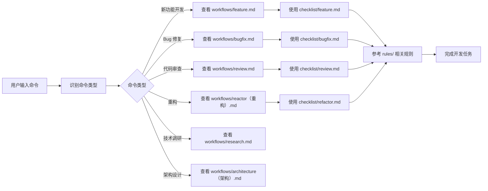

# Doctor Copilot Harness 引导入口

## 什么是 Harness

Harness 是 Doctor Copilot 项目的开发流程与规范管理系统，提供标准化的开发流程、检查清单、规则文档和知识文档，确保团队成员在统一的框架下进行协作开发。

## Harness 架构

```
.harness/
├── checklist/           # 检查清单：开发各阶段的检查项
├── workflows/           # 流程文档：标准开发流程
├── rules/               # 规则文档：技术规范和最佳实践
├── knowledge/           # 知识文档：项目架构和决策记录
└── templates/           # 模板文档：文档模板
```

## 如何使用 Harness

### 命令映射流程

当你输入一个开发命令时，按照以下流程进入 Harness：



### 常见命令映射

| 用户命令/意图 | Harness 入口 | 推荐阅读顺序 |
|---|---|---|
| `开发新功能` | [workflows/feature.md](./.harness/workflows/feature.md) | 流程 → 检查清单 → 规则 → 知识 |
| `修复 Bug` | [workflows/bugfix.md](./.harness/workflows/bugfix.md) | 流程 → 检查清单 → 规则 |
| `代码审查` | [workflows/review.md](./.harness/workflows/review.md) | 流程 → 检查清单 → 规则 |
| `重构代码` | [workflows/reactor（重构）.md](./.harness/workflows/reactor（重构）.md) | 流程 → 检查清单 → 规则 |
| `技术调研` | [workflows/research.md](./.harness/workflows/research.md) | 流程 → 模板 |
| `架构设计` | [workflows/architecture（架构）.md](./.harness/workflows/architecture（架构）.md) | 流程 → 知识 → 模板 |
| `发布版本` | [checklist/release.md](./.harness/checklist/release.md) | 检查清单 → 流程 |

## Harness 模块详解

### 1. Checklist（检查清单）

检查清单提供开发各阶段的标准化检查项，确保质量和一致性。

| 检查清单 | 用途 |
|---|---|
| [backend.md](./.harness/checklist/backend.md) | 后端开发检查项 |
| [frontend.md](./.harness/checklist/frontend.md) | 前端开发检查项 |
| [feature.md](./.harness/checklist/feature.md) | 新功能开发检查项 |
| [bugfix.md](./.harness/checklist/bugfix.md) | Bug 修复检查项 |
| [refactor.md](./.harness/checklist/refactor.md) | 重构检查项 |
| [review.md](./.harness/checklist/review.md) | 代码审查检查项 |
| [release.md](./.harness/checklist/release.md) | 发布检查项 |

### 2. Workflows（流程文档）

流程文档定义标准化的开发流程，确保团队成员遵循统一的工作方式。

| 流程文档 | 用途 |
|---|---|
| [feature.md](./.harness/workflows/feature.md) | 新功能开发流程 |
| [bugfix.md](./.harness/workflows/bugfix.md) | Bug 修复流程 |
| [review.md](./.harness/workflows/review.md) | 代码审查流程 |
| [reactor（重构）.md](./.harness/workflows/reactor（重构）.md) | 重构流程 |
| [research.md](./.harness/workflows/research.md) | 技术调研流程 |
| [architecture（架构）.md](./.harness/workflows/architecture（架构）.md) | 架构设计流程 |
| [full-stack-workflow.md](./.harness/workflows/full-stack-workflow.md) | 全栈工作流程 |

### 3. Rules（规则文档）

规则文档定义技术规范和最佳实践，确保代码质量和一致性。

| 规则分类 | 文件 | 用途 |
|---|---|---|
| 前端规则 | [state-management.md](./.harness/rules/frontend/state-management.md) | 状态管理规则 |
| | [component.md](./.harness/rules/frontend/component.md) | 组件开发规则 |
| | [performance.md](./.harness/rules/frontend/performance.md) | 前端性能规则 |
| 后端规则 | [api.md](./.harness/rules/backend/api.md) | API 设计规则 |
| | [service-design.md](./.harness/rules/backend/service-design.md) | 服务设计规则 |
| | [database.md](./.harness/rules/backend/database.md) | 数据库规则 |
| 架构规则 | [dependency.md](./.harness/rules/architecture/dependency.md) | 依赖管理规则 |
| | [api-design.md](./.harness/rules/architecture/api-design.md) | API 设计规范 |
| | [modularity.md](./.harness/rules/architecture/modularity.md) | 模块化规则 |
| 代码质量 | [code-quality.md](./.harness/rules/code-quality/code-quality.md) | 代码质量规则 |
| | [coding-style.md](./.harness/rules/code-quality/coding-style.md) | 编码风格规则 |
| | [error-handing.md](./.harness/rules/code-quality/error-handing.md) | 错误处理规则 |
| | [security.md](./.harness/rules/code-quality/security.md) | 安全规则 |
| Git 规则 | [branch.md](./.harness/rules/git/branch.md) | 分支管理规则 |
| | [commit.md](./.harness/rules/git/commit.md) | 提交规范规则 |

### 4. Knowledge（知识文档）

知识文档记录项目架构、技术决策和环境信息，帮助团队成员理解项目背景。

| 知识分类 | 文件 | 用途 |
|---|---|---|
| 决策记录 | [tech-stack.md](./.harness/knowledge/decisions/tech-stack.md) | 技术栈决策 |
| | [architecture-decisions.md](./.harness/knowledge/decisions/architecture-decisions.md) | 架构决策记录 |
| 架构文档 | [system.md](./.harness/knowledge/architecture/system.md) | 系统架构文档 |
| | [backend.md](./.harness/knowledge/architecture/backend.md) | 后端架构文档 |
| | [frontend.md](./.harness/knowledge/architecture/frontend.md) | 前端架构文档 |
| | [database.md](./.harness/knowledge/architecture/database.md) | 数据库架构文档 |
| | [infrastructure.md](./.harness/knowledge/architecture/infrastructure.md) | 基础设施文档 |
| 环境文档 | [development.md](./.harness/knowledge/environment/development.md) | 开发环境文档 |
| | [deployment.md](./.harness/knowledge/environment/deployment.md) | 部署环境文档 |
| 模块文档 | [auth.md](./.harness/knowledge/modules/auth.md) | 认证模块文档 |
| 项目概览 | [project.md](./.harness/knowledge/overview/project.md) | 项目概览 |
| | [goals.md](./.harness/knowledge/overview/goals.md) | 项目目标 |

### 5. Templates（模板文档）

模板文档提供标准化的文档模板，确保文档格式一致。

| 模板 | 用途 |
|---|---|
| [implementation.md](./.harness/templates/implementation.md) | 实现文档模板 |
| [report.md](./.harness/templates/report.md) | 报告模板 |
| [investigation.md](./.harness/templates/investigation.md) | 调查文档模板 |
| [plan.md](./.harness/templates/plan.md) | 计划文档模板 |
| [review.md](./.harness/templates/review.md) | 审查文档模板 |
| [decision.md](./.harness/templates/decision.md) | 决策文档模板 |

## 工作流程示例

### 示例：开发新功能

1. **查看流程文档**：阅读 [workflows/feature.md](./.harness/workflows/feature.md)
2. **查看检查清单**：阅读 [checklist/feature.md](./.harness/checklist/feature.md)
3. **参考规则文档**：根据功能类型参考相关规则
4. **参考知识文档**：了解项目架构和技术决策
5. **使用模板**：使用 [templates/implementation.md](./.harness/templates/implementation.md) 编写实现文档
6. **执行开发**：按照流程和检查清单完成开发
7. **代码审查**：使用 [checklist/review.md](./.harness/checklist/review.md) 进行审查
8. **发布**：使用 [checklist/release.md](./.harness/checklist/release.md) 进行发布

### 示例：修复 Bug

1. **查看流程文档**：阅读 [workflows/bugfix.md](./.harness/workflows/bugfix.md)
2. **查看检查清单**：阅读 [checklist/bugfix.md](./.harness/checklist/bugfix.md)
3. **执行修复**：按照流程和检查清单完成修复
4. **代码审查**：使用 [checklist/review.md](./.harness/checklist/review.md) 进行审查
5. **发布**：使用 [checklist/release.md](./.harness/checklist/release.md) 进行发布

## 与 docs 目录的关系

Harness 与 docs 目录是互补的：

| 目录 | 用途 |
|---|---|
| `docs/` | 产品需求、设计文档、技术规范（面向产品、设计、研发） |
| `.harness/` | 开发流程、检查清单、规则文档（面向研发） |

开发时应同时参考两个目录：
1. 从 `docs/` 获取需求和设计信息
2. 从 `.harness/` 获取开发流程和规范

## 快速参考

### 开发前必读
- [workflows/feature.md](./.harness/workflows/feature.md) - 新功能开发流程
- [checklist/feature.md](./.harness/checklist/feature.md) - 新功能检查清单
- [rules/git/branch.md](./.harness/rules/git/branch.md) - 分支管理规则
- [rules/git/commit.md](./.harness/rules/git/commit.md) - 提交规范规则

### 开发中必读
- [rules/frontend/component.md](./.harness/rules/frontend/component.md) - 组件开发规则
- [rules/backend/service-design.md](./.harness/rules/backend/service-design.md) - 服务设计规则
- [rules/code-quality/coding-style.md](./.harness/rules/code-quality/coding-style.md) - 编码风格规则

### 发布前必读
- [checklist/release.md](./.harness/checklist/release.md) - 发布检查清单
- [workflows/review.md](./.harness/workflows/review.md) - 代码审查流程
- [checklist/review.md](./.harness/checklist/review.md) - 代码审查检查清单

---

**重要提示**：本文件是 Harness 的引导入口，所有开发活动应遵循 Harness 定义的流程和规范。如有疑问，请先阅读相关文档。