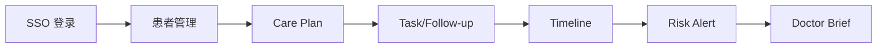

# Doctor Copilot

## 背景
Doctor Copilot 是连续医疗照护平台，定位为 **AI Care Platform**（非 AI 医生），用于支持医生、护士、患者、管理员在院外连续照护场景下协同工作。

## 为什么
院外随访常见信息断层、执行断层与风险识别滞后；本项目通过 Care Plan、Timeline、AI Follow-up、Risk Engine、Doctor Brief 与 Notification 形成闭环。

## 目标
- 构建可审计、可扩展的连续照护 Web 平台。
- 以 AI 增强临床执行效率，而非替代医生诊断决策。

## 非目标
- 不提供自动诊断结论。
- 不替代 HIS/EMR 主数据系统。

## 范围
当前范围覆盖 SSO 登录、患者管理、Care Plan、Task、Follow-up、Timeline、Alert、AI Chat、消息中心、管理后台与 AI/RAG 基础设施。

## 流程图（Mermaid）


## ASCII 图
```text
Auth -> Patient -> Plan -> Task -> Follow-up -> Timeline -> Alert -> Brief
```

## 技术栈
| 层 | 技术 |
|---|---|
| 前端 | Next.js, React, TypeScript, Tailwind CSS, shadcn/ui |
| 数据 | Supabase, Postgres, pgvector |
| AI | Vercel AI SDK, OpenAI, Claude, Gemini, DeepSeek, Qwen |
| 状态与数据 | TanStack Query, Server Actions |

## 目录
| 路径 | 说明 |
|---|---|
| `docs/` | 全量研发文档（可发布） |
| `app/` | Next.js App Router 页面 |
| `public/` | 静态资源 |

完整文档入口：[`docs/README.md`](./docs/README.md)

## 启动
```bash
npm install
npm run dev
```
默认访问：`http://localhost:3000`

## 开发
```bash
npm run lint
npm run build
```

## 部署
推荐部署：Vercel + Supabase。

基础步骤：
1. 配置环境变量（Supabase、AI Provider Keys、SSO 配置）。
2. 执行 `npm run build` 验证构建。
3. 发布到 Vercel。

## 贡献
1. Fork 并创建特性分支。
2. 提交代码与对应文档更新。
3. 通过 lint/build 后发起 PR。
4. 在 PR 中说明变更范围与验证方式。

## License
建议采用 MIT（如需变更请同步仓库 LICENSE 文件）。

## 相关文档
| 文档 | 链接 |
|---|---|
| Discovery | [docs/00-discovery/README.md](./docs/00-discovery/README.md) |
| PRD | [docs/01-prd/README.md](./docs/01-prd/README.md) |
| MVP | [docs/04-mvp/README.md](./docs/04-mvp/README.md) |
| TDD | [docs/05-tdd/README.md](./docs/05-tdd/README.md) |
| API | [docs/07-api/README.md](./docs/07-api/README.md) |
| Database | [docs/08-database/README.md](./docs/08-database/README.md) |
| AI | [docs/09-ai/README.md](./docs/09-ai/README.md) |
| Roadmap | [docs/10-roadmap/README.md](./docs/10-roadmap/README.md) |

## 示例
新增“慢病专项随访”功能时，建议按顺序更新 Discovery -> PRD -> TDD -> API -> Database -> UI 文档。

## 风险
| 风险 | 缓解 |
|---|---|
| 文档与代码脱节 | PR 模板要求文档联动更新 |
| 多模型行为差异 | 统一路由与回退策略 |

## Future Work
- 增加自动化文档质量检查（链接、术语、一致性）。
- 补充 ADR 与版本化发布说明。
