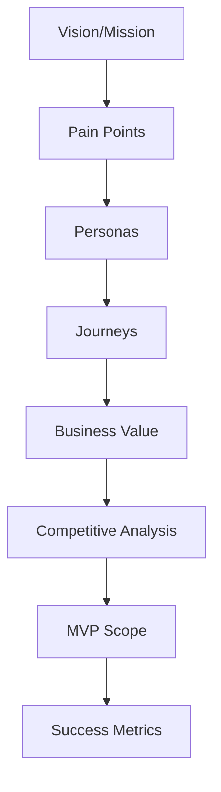

# 00 Discovery 总览

## 背景
Doctor Copilot 面向院外连续照护，核心对象为医生、护士、患者与管理员。

## 为什么
在产品立项前，需要统一愿景、问题定义与价值假设，降低后续 PRD 偏差。

## 目标
- 定义产品定位：AI Care Platform（非 AI 医生）。
- 明确角色痛点、旅程、MVP 范围与成功指标。

## 非目标
- 不定义具体 API 字段与数据库字段。
- 不包含 UI 像素级规范。

## 范围
包含 Vision、Mission、Pain Points、Personas、Journey、Business Value、Competitive Analysis、MVP、Success Metrics。

## 流程图（Mermaid）


## ASCII 图
```text
Discovery Inputs -> Product Hypothesis -> MVP Definition -> Metrics
```

## 文档索引
| 文档 | 链接 |
|---|---|
| Vision 与 Mission | [vision-mission.md](./vision-mission.md) |
| Pain Points | [pain-points.md](./pain-points.md) |
| Personas | [personas.md](./personas.md) |
| Patient Journey | [patient-journey.md](./patient-journey.md) |
| Doctor Journey | [doctor-journey.md](./doctor-journey.md) |
| Nurse Journey | [nurse-journey.md](./nurse-journey.md) |
| Business Value | [business-value.md](./business-value.md) |
| Competitive Analysis | [competitive-analysis.md](./competitive-analysis.md) |
| MVP Scope / Out of Scope | [mvp-scope.md](./mvp-scope.md) |
| Success Metrics | [success-metrics.md](./success-metrics.md) |

## 示例
当“患者随访完成率”低于目标时，优先回看 [nurse-journey.md](./nurse-journey.md) 与 [mvp-scope.md](./mvp-scope.md) 识别流程与范围问题。

## 风险
| 风险 | 说明 |
|---|---|
| 角色需求冲突 | 医生效率与患者体验目标可能冲突 |
| 指标选择偏差 | 过度关注 AI 指标而忽略临床流程指标 |

## Future Work
- 增加区域化医疗政策约束分析。
- 增加医疗机构采购决策链映射。

