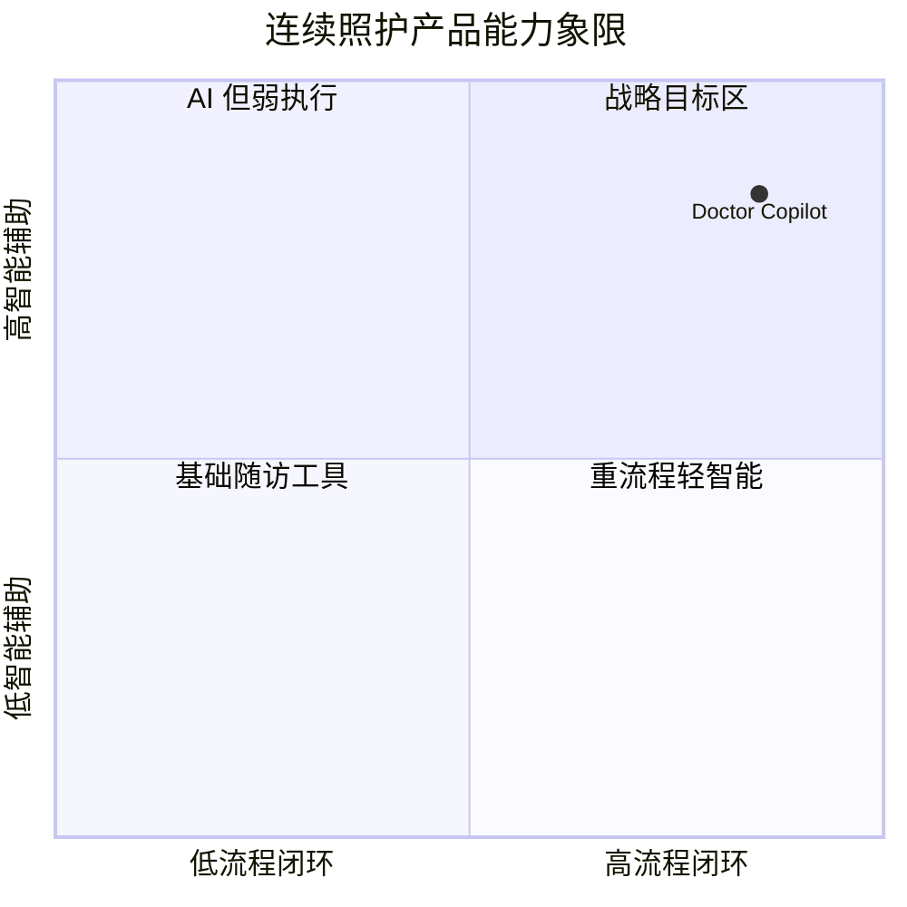

# Competitive Analysis

## 背景

市场存在患者管理、互联网医院与 AI 助手三类产品。

## 为什么

竞品分析用于验证定位差异与 MVP 边界。

## 目标

明确 Doctor Copilot 的可持续差异化能力。

## 非目标

- 不做品牌层面宣传比较。

## 范围

面向连续照护平台能力对比。

## 流程图（Mermaid）



## ASCII 图

```text
           智能辅助高
                ^
                |      Doctor Copilot
                |
流程闭环低 ------+-----------------> 流程闭环高
                |
```

## 表格

| 能力           | 通用随访系统 | 通用 AI 助手 | Doctor Copilot |
| -------------- | ------------ | ------------ | -------------- |
| Care Plan 闭环 | 中           | 低           | 高             |
| 风险引擎       | 低           | 中           | 高             |
| 临床可审计性   | 中           | 低           | 高             |

## 相关文档
| 文档 | 链接 |
|---|---|
| Discovery 总览 | [README.md](./README.md) |
| Vision/Mission | [vision-mission.md](./vision-mission.md) |
| MVP Scope | [mvp-scope.md](./mvp-scope.md) |

## 示例

相较纯聊天型产品，本平台将 AI 输出绑定到 Task、Timeline 与 Alert，不仅给建议，还驱动执行。

## 风险

| 风险       | 缓解                               |
| ---------- | ---------------------------------- |
| 竞品迭代快 | 以可配置 Prompt 与模型路由保持敏捷 |

## Future Work

- 增加按地区政策与医保支付模式的竞品维度。
