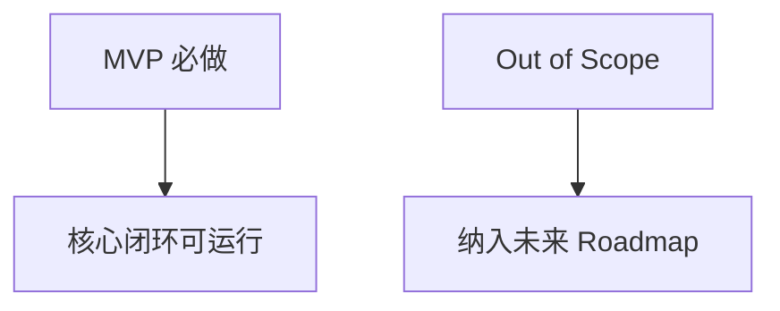

# MVP Scope / Out of Scope

## 背景
平台能力范围广，必须通过 MVP 控制交付风险。

## 为什么
过宽范围会导致交付延期与质量下降。

## 目标
定义首发必须项与明确不做项。

## 非目标
- 不承诺一次性覆盖所有病种与渠道。

## 范围
MVP 聚焦核心闭环：Care Plan、Timeline、AI Follow-up、Risk Engine、Doctor Brief、Notification、RAG。

## 流程图（Mermaid）


## ASCII 图
```text
Must Have: Plan/Task/Timeline/Alert/Brief
Not Now : Mobile App/IoT/Advanced Billing
```

## 表格
| 分类 | 内容 |
|---|---|
| MVP Scope | SSO、患者管理、Care Plan、任务、随访、时间线、告警、Brief、消息中心、基础 AI 配置与知识库 |
| Out of Scope | 原生移动端、医保结算、设备直连、自动诊断结论 |

## 相关文档
| 文档 | 链接 |
|---|---|
| Discovery 总览 | [README.md](./README.md) |
| MVP 计划 | [../04-mvp/README.md](../04-mvp/README.md) |
| PRD 总览 | [../01-prd/README.md](../01-prd/README.md) |

## 示例
MVP 支持“患者血压异常触发告警并生成医生摘要”，但不包含“可穿戴设备自动拉流”。

## 风险
| 风险 | 缓解 |
|---|---|
| 范围蔓延 | 所有新增需求需映射到 Roadmap 阶段 |

## Future Work
- 二期增加多机构租户隔离增强与移动端轻应用。
