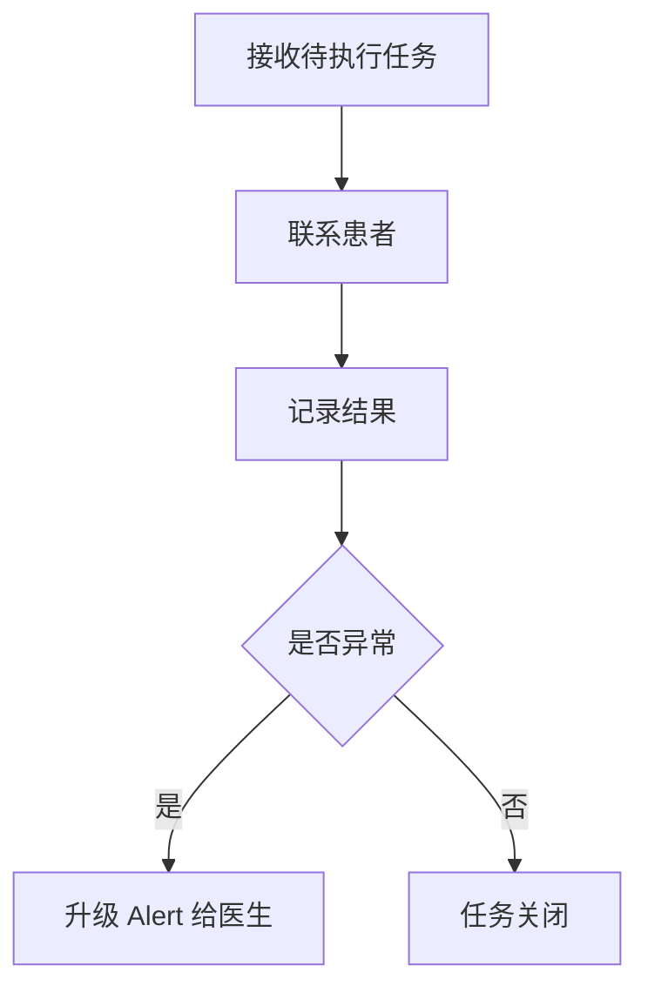

# Nurse Journey

## 背景
护士承担大量任务执行与患者沟通，是流程闭环关键角色。

## 为什么
护理执行效率直接影响随访覆盖率与数据完整性。

## 目标
定义护士的任务分发、跟进、升级处理流程。

## 非目标
- 不定义护士排班系统。

## 范围
Task、Follow-up、Notification、Alert 升级链路。

## 流程图（Mermaid）


## ASCII 图
```text
Queue -> Outreach -> Record -> (Alert?) -> Close
```

## 表格
| 场景 | 护士动作 | 系统支持 |
|---|---|---|
| 未响应 | 二次提醒 | 自动重试策略 |
| 异常指标 | 升级告警 | 一键转医生 |

## 相关文档
| 文档 | 链接 |
|---|---|
| Discovery 总览 | [README.md](./README.md) |
| PRD Task | [../01-prd/05-task.md](../01-prd/05-task.md) |
| PRD Follow-up | [../01-prd/06-follow-up.md](../01-prd/06-follow-up.md) |

## 示例
患者两次未回填体温，系统自动将任务标记为“需人工跟进”，护士点击触发电话随访脚本。

## 风险
| 风险 | 缓解 |
|---|---|
| 护士工作负载集中 | 任务优先级与批处理工具 |

## Future Work
- 引入语音记录自动结构化能力。
