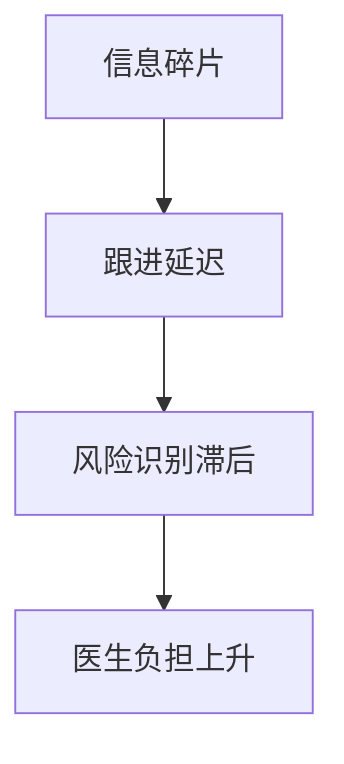

# Pain Points

## 背景
连续照护场景中，院内外数据、任务执行与风险识别常常割裂。

## 为什么
痛点定义是 PRD 需求优先级与 MVP 边界的直接输入。

## 目标
识别医生、护士、患者、管理员的高频高损耗问题。

## 非目标
- 不讨论 UI 风格偏好。
- 不定义技术选型细节。

## 范围
仅覆盖院外连续照护工作流，不含住院 EMR 全量场景。

## 流程图（Mermaid）


## ASCII 图
```text
Data Silos -> Delay -> Missed Risk -> Burnout
```

## 表格
| 角色 | 核心痛点 | 业务影响 |
|---|---|---|
| 医生 | 无法快速掌握患者趋势 | 决策延迟 |
| 护士 | 随访任务分散、回收率低 | 执行效率低 |
| 患者 | 沟通渠道不统一 | 依从性下降 |
| 管理员 | 权限与审计配置复杂 | 合规风险 |

## 相关文档
| 文档 | 链接 |
|---|---|
| Discovery 总览 | [README.md](./README.md) |
| Personas | [personas.md](./personas.md) |
| PRD 总览 | [../01-prd/README.md](../01-prd/README.md) |

## 示例
患者连续 3 天未回填指标，护士在多个系统切换后才发现，导致干预窗口错过。

## 风险
| 风险 | 缓解 |
|---|---|
| 痛点采样偏差 | 多角色访谈 + 行为数据复核 |

## Future Work
- 增加分级医疗与转诊链路痛点分析。
