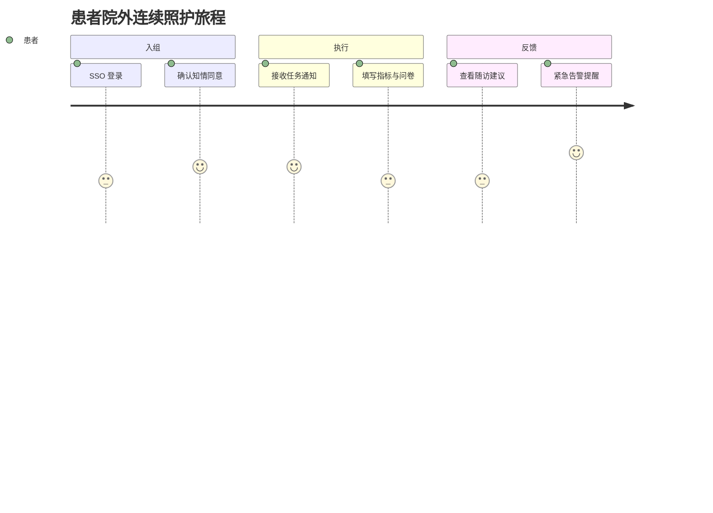

# Patient Journey

## 背景
患者是连续照护数据来源与执行主体，其体验直接影响依从性。

## 为什么
若患者流程过重，会直接降低任务完成率与风险预警准确度。

## 目标
定义患者从入组到长期随访的关键触点。

## 非目标
- 不覆盖线下门诊全部流程。

## 范围
Web 端患者账号在平台内的行为轨迹。

## 流程图（Mermaid）


## ASCII 图
```text
Enroll -> Receive Tasks -> Submit Data -> Receive Feedback -> Repeat
```

## 表格
| 阶段 | 输入 | 输出 |
|---|---|---|
| 入组 | 账号、计划说明 | 激活患者档案 |
| 执行 | 任务/问卷 | 结构化观测数据 |
| 反馈 | AI/护理建议 | 行为调整 |

## 相关文档
| 文档 | 链接 |
|---|---|
| Discovery 总览 | [README.md](./README.md) |
| User Flow | [../02-user-flow/README.md](../02-user-flow/README.md) |
| PRD Follow-up | [../01-prd/06-follow-up.md](../01-prd/06-follow-up.md) |

## 示例
患者收到“今日晚间血压记录”提醒后在 2 分钟内完成回填，系统自动更新 Timeline。

## 风险
| 风险 | 缓解 |
|---|---|
| 患者数字素养差异大 | 任务文案模板分级、低复杂度表单 |

## Future Work
- 增加多语言与语音输入流程。
