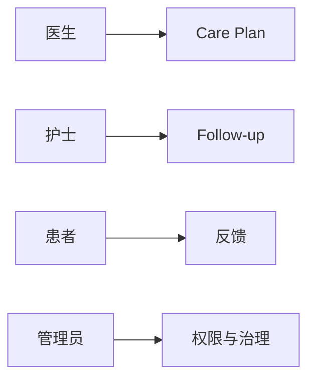

# Personas

## 背景
Doctor Copilot 需同时服务 4 类角色，能力边界不同。

## 为什么
角色建模决定权限、页面信息密度与流程入口设计。

## 目标
建立一致、可执行的人物画像与核心任务。

## 非目标
- 不做市场人群规模预测。

## 范围
医生、护士、患者、管理员的平台内行为。

## 流程图（Mermaid）


## ASCII 图
```text
Doctor: Decide
Nurse : Execute
Patient: Respond
Admin : Govern
```

## 表格
| Persona | 主要目标 | 关键动作 |
|---|---|---|
| 医生 | 快速决策 | 查看 Brief、调整计划 |
| 护士 | 高效执行 | 推送任务、跟进、记录 |
| 患者 | 低负担反馈 | 回填指标、完成任务 |
| 管理员 | 安全可控 | 配置 SSO、角色、审计 |

## 相关文档
| 文档 | 链接 |
|---|---|
| Discovery 总览 | [README.md](./README.md) |
| Doctor Journey | [doctor-journey.md](./doctor-journey.md) |
| Nurse Journey | [nurse-journey.md](./nurse-journey.md) |

## 示例
医生每天晨会前打开 Doctor Brief，优先查看高风险患者列表。

## 风险
| 风险 | 缓解 |
|---|---|
| Persona 过度理想化 | 基于真实操作日志持续修订 |

## Future Work
- 增加“家属/照护者”角色建模。
