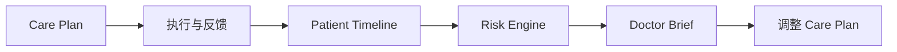

# Vision 与 Mission

## 背景
连续照护存在“出院后信息断层”，医生无法高频、结构化地了解患者状态变化。

## 为什么
传统随访系统偏任务分发，缺少跨时间线洞察与 AI 辅助决策闭环。

## 目标
- Vision：成为院外连续照护的临床协同基础设施。
- Mission：通过 Care Plan + AI Follow-up + Risk Engine，提升照护连续性与质量。

## 非目标
- 不替代医生诊断与处方决策。
- 不提供“自动诊断结论”作为系统输出。

## 范围
适用于 Web 端的医生、护士、患者、管理员协同场景。

## 流程图（Mermaid）


## ASCII 图
```text
Plan -> Follow-up -> Timeline -> Risk -> Brief -> Plan(Next)
```

## 表格
| 维度 | Vision 约束 |
|---|---|
| 临床责任 | 始终由医生承担最终责任 |
| AI 输出 | 仅作建议，不作诊断 |
| 合规 | 满足最小权限与审计要求 |

## 相关文档
| 文档 | 链接 |
|---|---|
| Discovery 总览 | [README.md](./README.md) |
| MVP Scope | [mvp-scope.md](./mvp-scope.md) |
| PRD 总览 | [../01-prd/README.md](../01-prd/README.md) |

## 示例
系统可提示“未来 72 小时血压失控风险上升”，但不会给出“确诊高血压恶化”的自动结论。

## 风险
| 风险 | 缓解 |
|---|---|
| 用户误解 AI 权限 | 在 UI 显示“AI 建议非诊断结论” |
| 目标泛化 | 以 MVP 指标约束阶段性交付 |

## Future Work
- 拆分专病版本（如心衰、糖尿病）。
- 建立机构级对标 KPI 体系。
