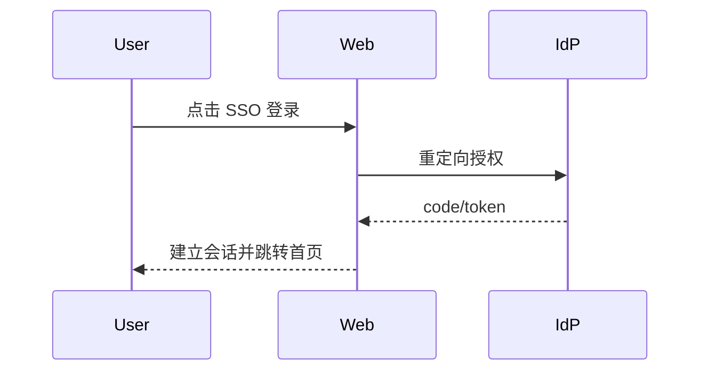

# PRD-01 登录（SSO）

## 背景
平台面向医疗机构用户，需统一身份入口与会话治理。

## 为什么
SSO 是权限与审计的前置条件。

## 目标
支持基于机构 IdP 的 SSO 登录、登出、会话续期。

## 非目标
- 不支持本地账号密码注册。

## 范围
Web 登录页、回调处理、会话状态同步。

## 流程图（Mermaid）


## ASCII 图
```text
User -> Web -> IdP -> Web(Session) -> Dashboard
```

## 表格
| 项 | 说明 |
|---|---|
| Actor | 医生/护士/管理员 |
| 输入 | SSO 断言 |
| 输出 | Access Token + Session |

## 相关文档
| 文档 | 链接 |
|---|---|
| PRD 总览 | [README.md](./README.md) |
| 权限 | [13-permission.md](./13-permission.md) |
| TDD | [../05-tdd/README.md](../05-tdd/README.md) |

## 示例
用户首次登录后自动加载角色权限并落到对应首页组件。

## 风险
| 风险 | 缓解 |
|---|---|
| SSO 时钟漂移 | 增加 token 容忍窗口与统一 NTP |

## Future Work
- 支持多 IdP 动态路由。
