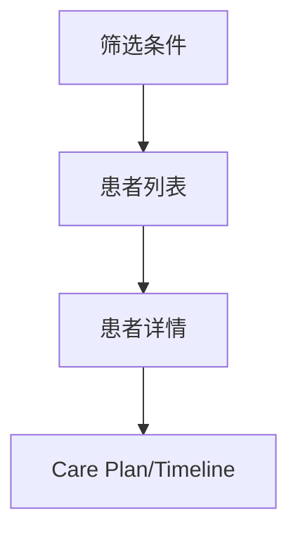

# PRD-03 患者管理

## 背景
患者管理是连续照护对象管理入口。

## 为什么
需要统一患者档案、状态与分组策略。

## 目标
支持患者检索、标签、分组、状态筛选、详情跳转。

## 非目标
- 不替代 HIS 主档管理。

## 范围
患者列表、详情入口、分层筛选。

## 流程图（Mermaid）


## ASCII 图
```text
Filters -> Patient List -> Profile -> Clinical Modules
```

## 表格
| 字段 | 用途 |
|---|---|
| 风险等级 | 排序优先级 |
| 最近随访时间 | 判断活跃度 |
| 当前计划状态 | 执行追踪 |

## 相关文档
| 文档 | 链接 |
|---|---|
| PRD 总览 | [README.md](./README.md) |
| Timeline | [07-timeline.md](./07-timeline.md) |
| Database | [../08-database/README.md](../08-database/README.md) |

## 示例
护士筛选“7 天未响应 + 高风险”患者并批量发起随访任务。

## 风险
| 风险 | 缓解 |
|---|---|
| 列表复杂度上升 | 预置常用筛选器 |

## Future Work
- 增加 cohort（队列）保存与共享。
