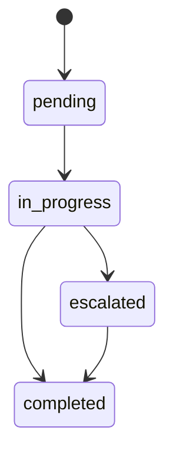

# PRD-05 Task

## 背景
Task 是 Care Plan 的可执行单元。

## 为什么
任务可追踪性决定执行闭环质量。

## 目标
支持任务生成、分配、状态流转与回收统计。

## 非目标
- 不做通用项目管理工具。

## 范围
患者任务、护士任务、医生复核任务。

## 流程图（Mermaid）


## ASCII 图
```text
pending -> in_progress -> completed
              \-> escalated -> completed
```

## 表格
| 状态 | 触发条件 |
|---|---|
| pending | 计划发布后自动生成 |
| in_progress | 用户开始处理 |
| escalated | 发现风险需升级 |
| completed | 数据回填与确认完成 |

## 相关文档
| 文档 | 链接 |
|---|---|
| PRD 总览 | [README.md](./README.md) |
| Follow-up | [06-follow-up.md](./06-follow-up.md) |
| API | [../07-api/README.md](../07-api/README.md) |

## 示例
患者未按时提交问卷，任务超时后进入 escalated 并通知护士。

## 风险
| 风险 | 缓解 |
|---|---|
| 任务积压 | 自动优先级 + 批处理 |

## Future Work
- 支持任务 SLA 与逾期评分。
