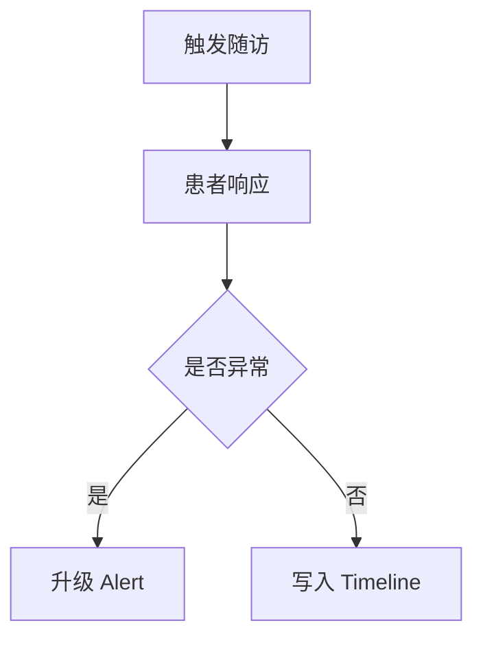

# PRD-06 Follow-up

## 背景
随访用于持续收集患者状态与干预反馈。

## 为什么
随访质量直接影响风险引擎有效性。

## 目标
支持自动与人工随访，记录结构化结果。

## 非目标
- 不替代电话系统本身。

## 范围
随访计划、执行记录、结果归档。

## 流程图（Mermaid）


## ASCII 图
```text
Trigger -> Response -> (Alert?) -> Timeline
```

## 表格
| 类型 | 执行方 |
|---|---|
| 自动消息随访 | 系统 |
| 人工电话随访 | 护士 |

## 相关文档
| 文档 | 链接 |
|---|---|
| PRD 总览 | [README.md](./README.md) |
| Task | [05-task.md](./05-task.md) |
| AI 设计 | [../09-ai/README.md](../09-ai/README.md) |

## 示例
AI 生成随访问答模板，护士确认后发送给患者。

## 风险
| 风险 | 缓解 |
|---|---|
| 患者低响应率 | 多渠道提醒与重试策略 |

## Future Work
- 增加语音机器人随访。
