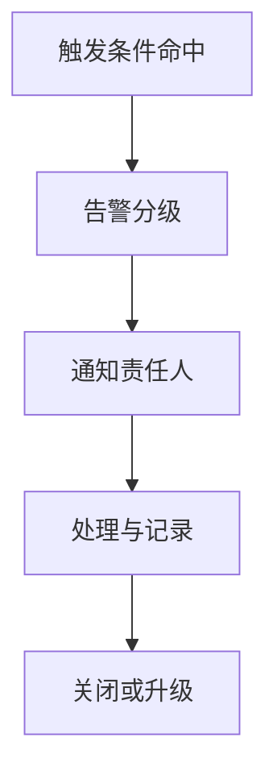

# PRD-08 Alert

## 背景
Alert 用于识别并升级潜在临床风险。

## 为什么
没有告警闭环会导致高风险患者漏管。

## 目标
支持告警触发、分级、派单、确认与关闭。

## 非目标
- 不自动下诊断结论。

## 范围
规则告警与模型告警统一处理。

## 流程图（Mermaid）


## ASCII 图
```text
Trigger -> Severity -> Notify -> Action -> Close/Escalate
```

## 表格
| 等级 | SLA |
|---|---|
| P1 | 30 分钟 |
| P2 | 2 小时 |
| P3 | 24 小时 |

## 相关文档
| 文档 | 链接 |
|---|---|
| PRD 总览 | [README.md](./README.md) |
| Notification | [11-notification.md](./11-notification.md) |
| MVP | [../04-mvp/README.md](../04-mvp/README.md) |

## 示例
连续两次极端血压值触发 P1 告警并推送至值班医生。

## 风险
| 风险 | 缓解 |
|---|---|
| 告警疲劳 | 阈值校准 + 去重压缩 |

## Future Work
- 增加个体化阈值模型。
