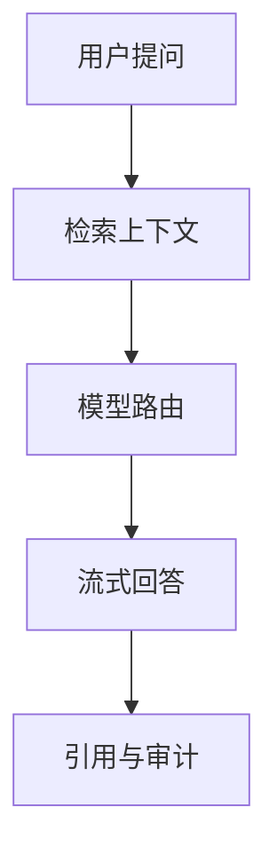

# PRD-10 AI Chat

## 背景
AI Chat 为医生/护士提供上下文问答与操作辅助。

## 为什么
降低信息检索成本，提升决策速度。

## 目标
支持基于患者上下文、知识库与时间线的对话。

## 非目标
- 不输出诊断结论。

## 范围
会话、上下文注入、引用溯源、流式响应。

## 流程图（Mermaid）


## ASCII 图
```text
Question -> Context -> Model -> Answer(+citations)
```

## 表格
| 模式 | 说明 |
|---|---|
| 患者上下文问答 | 绑定患者 ID |
| 通用知识问答 | 仅知识库上下文 |

## 相关文档
| 文档 | 链接 |
|---|---|
| PRD 总览 | [README.md](./README.md) |
| Knowledge Base | [18-knowledge-base.md](./18-knowledge-base.md) |
| AI 设计 | [../09-ai/README.md](../09-ai/README.md) |

## 示例
医生问“过去 7 天该患者血压趋势如何？”系统返回图表摘要和来源事件。

## 风险
| 风险 | 缓解 |
|---|---|
| 幻觉信息 | 强制引用 + 低置信度提示 |

## Future Work
- 增加多轮任务执行型 Agent。
