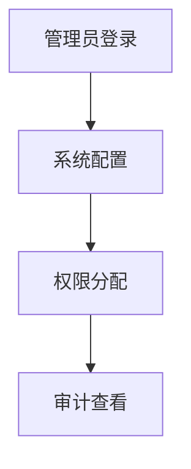

# PRD-12 Admin

## 背景
管理员负责平台租户配置、账号治理与审计。

## 为什么
医疗系统必须具备强治理能力。

## 目标
提供租户配置、账号管理、审计查询。

## 非目标
- 不实现财务计费后台。

## 范围
管理员控制台模块集合。

## 流程图（Mermaid）


## ASCII 图
```text
Admin Console = Config + Access + Audit
```

## 表格
| 模块 | 功能 |
|---|---|
| 用户管理 | 启停用、角色分配 |
| 系统配置 | AI/通知/安全策略 |
| 审计 | 操作与访问日志查询 |

## 相关文档
| 文档 | 链接 |
|---|---|
| PRD 总览 | [README.md](./README.md) |
| 权限 | [13-permission.md](./13-permission.md) |
| 设置 | [15-settings.md](./15-settings.md) |

## 示例
管理员撤销离职护士权限并导出最近 90 天操作记录。

## 风险
| 风险 | 缓解 |
|---|---|
| 误操作影响大 | 二次确认 + 审计回放 |

## Future Work
- 支持细粒度策略模拟。
