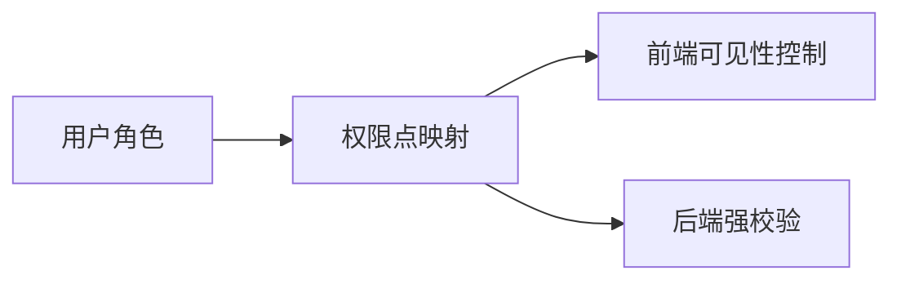

# PRD-13 权限

## 背景
多角色协作要求严格最小权限控制。

## 为什么
权限失控会带来临床与合规风险。

## 目标
实现 RBAC + 资源级权限校验。

## 非目标
- 不实现 ABAC 全量策略引擎（MVP）。

## 范围
角色、权限点、页面与 API 双重校验。

## 流程图（Mermaid）


## ASCII 图
```text
Role -> Permission -> UI Guard + API Guard
```

## 表格
| 角色 | 关键权限 |
|---|---|
| 医生 | 计划审批、告警处理 |
| 护士 | 任务执行、随访记录 |
| 管理员 | 账号与策略配置 |

## 相关文档
| 文档 | 链接 |
|---|---|
| PRD 总览 | [README.md](./README.md) |
| 登录 | [01-login.md](./01-login.md) |
| TDD | [../05-tdd/README.md](../05-tdd/README.md) |

## 示例
护士可查看患者任务但不可修改医生审核后的 Care Plan。

## 风险
| 风险 | 缓解 |
|---|---|
| 前后端权限不一致 | 统一权限字典与自动化校验 |

## Future Work
- 支持基于科室与患者归属的动态授权。
