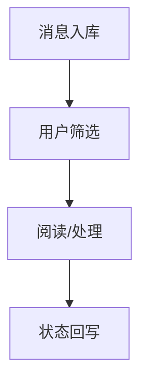

# PRD-14 消息中心

## 背景
消息中心聚合通知、系统公告与流程回执。

## 为什么
分散消息入口会增加遗漏概率。

## 目标
提供统一收件箱、筛选、批量已读与跳转。

## 非目标
- 不做即时聊天系统。

## 范围
站内收件箱与消息状态管理。

## 流程图（Mermaid）


## ASCII 图
```text
Inbox -> Filter -> Open -> Action -> Mark
```

## 表格
| 消息类型 | 默认保留期 |
|---|---|
| 告警 | 180 天 |
| 任务通知 | 90 天 |
| 系统公告 | 365 天 |

## 相关文档
| 文档 | 链接 |
|---|---|
| PRD 总览 | [README.md](./README.md) |
| Notification | [11-notification.md](./11-notification.md) |
| UI | [../06-ui/README.md](../06-ui/README.md) |

## 示例
护士在消息中心批量处理“任务提醒”并一键跳转待办列表。

## 风险
| 风险 | 缓解 |
|---|---|
| 低优先消息淹没高优先事件 | 优先级分栏展示 |

## Future Work
- 增加消息规则自定义。
