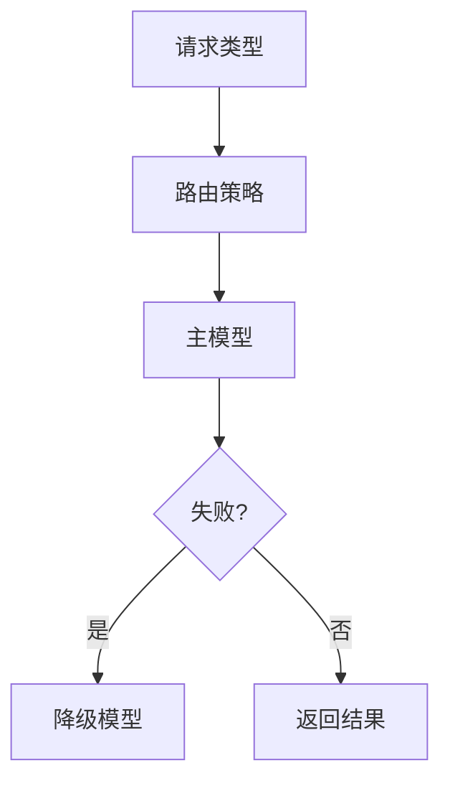

# PRD-16 AI 配置

## 背景
平台接入多模型，需统一治理模型能力与成本。

## 为什么
缺少配置中心会导致行为不一致与成本失控。

## 目标
支持模型供应商、路由规则、温度与超时配置。

## 非目标
- 不提供训练与微调平台。

## 范围
模型元数据管理、默认策略、回退策略。

## 流程图（Mermaid）


## ASCII 图
```text
Intent -> Router -> Model A -> Fallback Model B
```

## 表格
| 配置项 | 示例 |
|---|---|
| model_for_brief | claude-sonnet |
| model_for_chat | gpt-4o-mini |
| timeout_ms | 12000 |

## 相关文档
| 文档 | 链接 |
|---|---|
| PRD 总览 | [README.md](./README.md) |
| Prompt 管理 | [17-prompt-management.md](./17-prompt-management.md) |
| AI 设计 | [../09-ai/README.md](../09-ai/README.md) |

## 示例
Doctor Brief 默认走 Claude，超时后自动回退到 Gemini。

## 风险
| 风险 | 缓解 |
|---|---|
| 路由误配影响质量 | 配置发布前离线评测 |

## Future Work
- 引入成本感知型动态路由。
