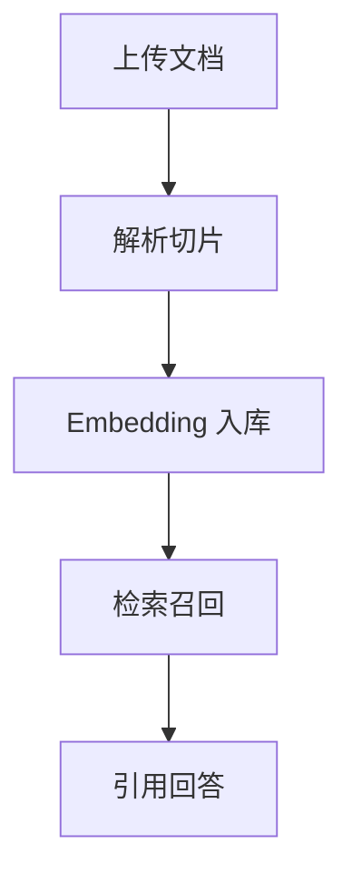

# PRD-18 Knowledge Base

## 背景
RAG 质量依赖知识库内容结构与更新机制。

## 为什么
知识过期或无结构会导致 AI 回答失真。

## 目标
支持文档上传、切片、索引、检索与版本管理。

## 非目标
- 不做文档编辑器。

## 范围
知识条目生命周期与检索可追溯。

## 流程图（Mermaid）


## ASCII 图
```text
Docs -> Chunk -> Embed -> Retrieve -> Cite
```

## 表格
| 模块 | 功能 |
|---|---|
| Ingestion | 清洗与切片 |
| Indexing | 向量索引 |
| Retrieval | 召回与重排 |

## 相关文档
| 文档 | 链接 |
|---|---|
| PRD 总览 | [README.md](./README.md) |
| AI Chat | [10-ai-chat.md](./10-ai-chat.md) |
| Database | [../08-database/README.md](../08-database/README.md) |

## 示例
上传新版出院指导后，AI Chat 自动优先引用最新版本段落。

## 风险
| 风险 | 缓解 |
|---|---|
| 脏数据污染检索 | 文档审核状态与隔离索引 |

## Future Work
- 支持多租户知识隔离策略。
