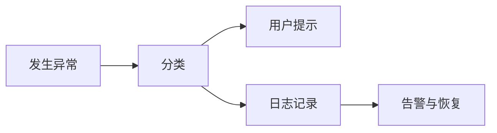

# PRD-19 异常处理

## 背景
医疗场景对可用性与错误可解释性要求高。

## 为什么
错误处理不完善会直接影响业务连续性与用户信任。

## 目标
定义用户可见错误、系统错误、降级与恢复策略。

## 非目标
- 不定义底层监控平台实现细节。

## 范围
前端错误提示、后端错误码、重试与告警。

## 流程图（Mermaid）


## ASCII 图
```text
Error -> Classify -> Notify User + Log -> Recover
```

## 表格
| 异常类 | 处理策略 |
|---|---|
| 用户输入错误 | 即时校验提示 |
| 外部模型超时 | 回退模型 + 告知延迟 |
| 数据库故障 | 只读降级 + 告警 |

## 相关文档
| 文档 | 链接 |
|---|---|
| PRD 总览 | [README.md](./README.md) |
| 验收标准 | [20-acceptance-criteria.md](./20-acceptance-criteria.md) |
| TDD | [../05-tdd/README.md](../05-tdd/README.md) |

## 示例
AI 请求超时后，界面提示“已切换备用模型，请稍后刷新摘要”。

## 风险
| 风险 | 缓解 |
|---|---|
| 过度重试放大故障 | 指数退避 + 熔断 |

## Future Work
- 增加故障演练剧本（GameDay）。
