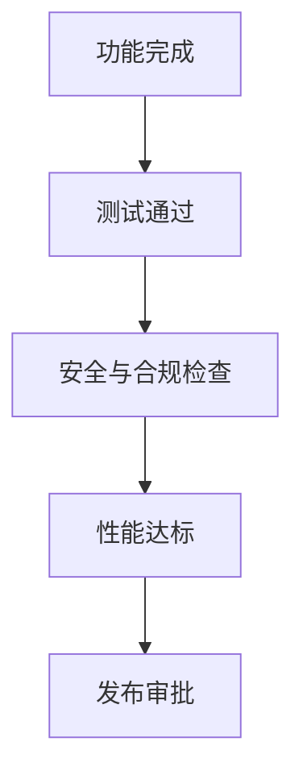

# PRD-20 验收标准

## 背景
多模块并行开发需要统一可执行验收标准。

## 为什么
验收标准缺失会导致“功能完成但不可上线”。

## 目标
定义功能、性能、安全、可观测性四类验收门槛。

## 非目标
- 不替代详细测试用例文档。

## 范围
覆盖 MVP 全模块上线前门禁。

## 流程图（Mermaid）


## ASCII 图
```text
Feature Done -> Test -> Security -> Perf -> Release
```

## 表格
| 类别 | 基线 |
|---|---|
| 功能 | 关键用户路径通过率 100% |
| 质量 | P0/P1 缺陷为 0 |
| 性能 | P95 API < 500ms（核心读接口） |
| 安全 | 高危漏洞为 0 |

## 相关文档
| 文档 | 链接 |
|---|---|
| PRD 总览 | [README.md](./README.md) |
| MVP | [../04-mvp/README.md](../04-mvp/README.md) |
| TDD | [../05-tdd/README.md](../05-tdd/README.md) |

## 示例
“Alert 处理链路”必须满足：触发->通知->确认->关闭全链路可审计。

## 风险
| 风险 | 缓解 |
|---|---|
| 验收口径不一致 | 统一门禁脚本与 checklist |

## Future Work
- 增加按病种分层验收模板。
