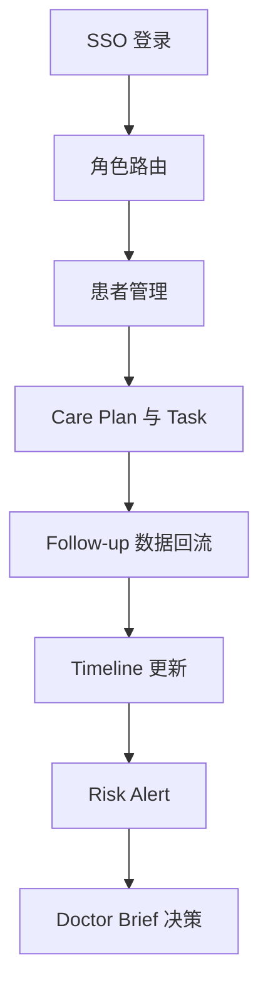

# 02 User Flow

## 背景
Doctor Copilot 涉及多角色协作，需定义跨角色端到端流。

## 为什么
用户流是 PRD、UI、API 与测试用例的共识层。

## 目标
明确医生、护士、患者、管理员在核心闭环中的交互路径。

## 非目标
- 不包含像素级交互细节（见 [06-ui](../06-ui/README.md)）。

## 范围
SSO 登录、患者管理、计划执行、随访、告警、摘要、通知。

## 流程图（Mermaid）


## ASCII 图
```text
Login -> Role Home -> Patient -> Plan/Task -> Follow-up -> Timeline -> Alert -> Brief
```

## 表格
| 角色 | 主流程 | 关键产出 |
|---|---|---|
| 医生 | Brief -> Timeline -> Plan 调整 | 新计划版本 |
| 护士 | Task 队列 -> Follow-up -> 升级告警 | 执行记录 |
| 患者 | 接收任务 -> 提交数据 | Observation |
| 管理员 | 配置权限 -> 审计 | 合规记录 |

## 示例
护士在 Follow-up 发现异常后升级 P1 告警，医生在 Brief 中确认并更新 Care Plan。

## 风险
| 风险 | 缓解 |
|---|---|
| 流程分支过多 | 固化 MVP 标准路径与异常分支 |

## Future Work
- 增加跨机构转诊与协作流程。

