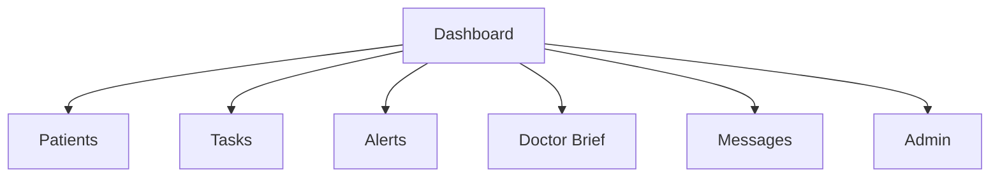

# 03 Information Architecture

## 背景
信息架构决定页面导航、领域模型与权限边界。

## 为什么
缺乏 IA 会导致导航混乱与模块耦合。

## 目标
定义导航层级、领域对象关系与模块归属。

## 非目标
- 不替代数据库物理设计（见 [08-database](../08-database/README.md)）。

## 范围
Web 端一级导航、二级功能与核心实体关系。

## 流程图（Mermaid）


## ASCII 图
```text
Global Nav
├─ Dashboard
├─ Patients
├─ Tasks
├─ Alerts
├─ AI
└─ Admin
```

## 表格
| 领域 | 关键实体 |
|---|---|
| Care | CarePlan, Task, FollowUp |
| Clinical | Observation, TimelineEvent, Alert |
| Governance | User, Role, Permission, Audit |
| AI | Prompt, KnowledgeChunk, Embedding |

## 示例
“Patient 详情页”下按 Tab 展示 Timeline、Care Plan、Task、AI Chat，避免跨模块跳转。

## 风险
| 风险 | 缓解 |
|---|---|
| 导航深度过深 | 一级导航固定 + 二级 Tab |

## Future Work
- 引入任务中心与消息中心的统一工作流视图。

