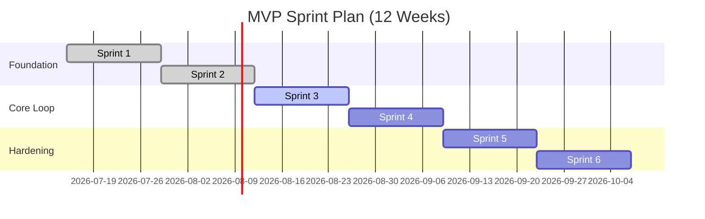

# 04 MVP 交付计划

## 背景

MVP 需要在有限资源内实现临床可运行闭环。

## 为什么

分 Sprint 与里程碑可降低交付风险并提升可预测性。

## 目标

定义 Sprint、Milestone、DoD、优先级与风险。

## 非目标

- 不覆盖一年后所有增强能力（见 [10-roadmap](../10-roadmap/README.md)）。

## 范围

12 周（6 个 Sprint）MVP 计划。

## 流程图（Mermaid）



## ASCII 图

```text
S1-S2: 基础能力
S3-S4: 核心闭环
S5-S6: 稳定性与上线
```

## 表格

| Sprint | 里程碑                   | DoD（Definition of Done） |
| ------ | ------------------------ | ------------------------- |
| S1     | SSO + RBAC               | 登录、权限、审计可用      |
| S2     | 患者管理 + Care Plan     | 计划可发布并版本化        |
| S3     | Task + Follow-up         | 执行闭环可追踪            |
| S4     | Timeline + Alert + Brief | 风险处理闭环成立          |
| S5     | AI Chat + 知识库         | RAG 引用可审计            |
| S6     | Admin + 稳定性           | 验收标准达标              |

| Feature Priority | 说明                                     |
| ---------------- | ---------------------------------------- |
| P0               | 登录、权限、患者、计划、任务、随访、告警 |
| P1               | Brief、AI Chat、知识库、消息中心         |
| P2               | 高级配置与体验优化                       |

## 示例

若 S3 任务完成率低于 90%，S4 需冻结新需求优先修复执行闭环问题。

## 风险

| 风险             | 缓解               |
| ---------------- | ------------------ |
| 模型输出质量波动 | 预置多模型回退策略 |
| 跨角色联调复杂   | 建立端到端冒烟脚本 |

## Future Work

- 引入发布列车（release train）与灰度里程碑。
