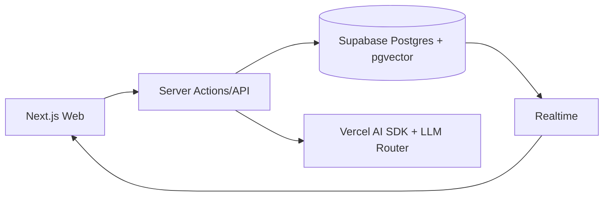

# 05 TDD（Technical Design Document）

## 背景
项目技术栈为 Next.js/React/TypeScript/Supabase/Postgres/pgvector/Vercel AI SDK。

## 为什么
需要可直接开发的技术设计，统一工程结构、边界和非功能性约束。

## 目标
给出可落地的整体架构、模块划分、工程规范与运行方案。

## 非目标
- 不在本文给出每个接口的完整 OpenAPI（见 [07-api](../07-api/README.md)）。

## 范围
覆盖 Monorepo、Auth、RLS、Storage、Realtime、Server Actions、API、Streaming、错误处理、日志与观测、部署与环境、安全、性能、测试。

## 流程图（Mermaid）


## ASCII 图
```text
apps/web
  -> app/(routes)
  -> features/*
  -> server/actions/*
  -> lib/{supabase,ai,auth,logger}
packages/*
  -> ui
  -> config
  -> types
```

## 模块与目录结构（Monorepo）
| 目录 | 职责 |
|---|---|
| apps/web | Next.js Web 应用（App Router） |
| packages/ui | shadcn/ui 与共享组件 |
| packages/config | ESLint/TS/Tailwind 配置 |
| packages/types | 共享类型与 DTO |

## 关键设计
| 主题 | 方案 |
|---|---|
| Auth | SSO -> Supabase Auth -> Session Cookie |
| Supabase | Postgres + pgvector + Storage + Realtime |
| RLS | 以 org_id + role_claim 为策略核心 |
| Server Actions | 作为写操作入口，读操作可走 route handlers |
| API | REST 风格 + 统一错误码 + cursor 分页 |
| Streaming | AI Chat 使用流式响应与可取消请求 |
| Error Handling | 明确错误边界、业务错误与系统错误分层 |
| Logging | 结构化日志（request_id/user_id/patient_id） |
| Observability | 指标+日志+追踪三件套 |
| Deployment | Vercel + Supabase，多环境隔离 |
| Security | 最小权限、RLS、审计、密钥轮换 |
| Performance | 缓存、并行查询、索引、懒加载 |
| Testing | 单元/集成/E2E/契约测试 |

## Feature Structure
```text
features/
  patient/
    components/
    actions/
    queries/
    schemas/
  care-plan/
  timeline/
  alert/
  ai-chat/
```

## 示例
`features/care-plan/actions/create-care-plan.ts` 通过 server action 调用 Supabase RPC，写入 `care_plans` 与 `timeline_events`，并触发实时通知。

## 风险
| 风险 | 缓解 |
|---|---|
| RLS 策略遗漏 | 所有表默认 deny，逐条放行并配套测试 |
| AI 请求不可控 | 限流、超时、回退模型、审计日志 |
| Server Actions 过重 | 复杂聚合读走 API route + 缓存 |

## Future Work
- 引入事件总线（Outbox）实现跨模块最终一致性。
- 增加按病种的垂直 feature package。

