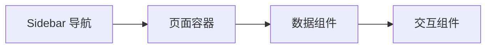
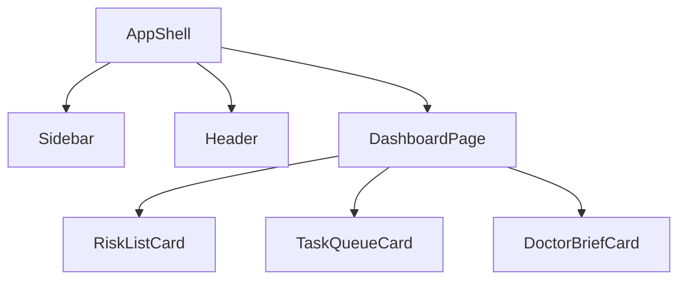

# 06 UI 设计说明

## 背景
UI 需支撑医疗高密度信息场景与多角色任务流。

## 为什么
一致的页面结构和组件树是可维护前端的基础。

## 目标
定义页面结构、Sidebar、Dashboard、Wireframe、组件树。

## 非目标
- 不定义品牌视觉规范与营销页面。

## 范围
医生/护士工作台、患者详情、消息、管理后台。

## 流程图（Mermaid）


## ASCII 图
```text
+-------------------------------+
| Sidebar | Header              |
|         |---------------------|
|         | Main Content        |
|         | (Cards/Tables/Chat) |
+-------------------------------+
```

## 页面结构表
| 页面 | 主区域 |
|---|---|
| Dashboard | KPI + Risk Queue + To-do |
| Patient Detail | Timeline + Care Plan + Task + AI Chat |
| Message Center | Inbox + Filter + Detail |
| Admin | User/Role/AI/Prompt/KB 配置 |

## 组件树（示例）


## Wireframe（ASCII）
```text
[Dashboard]
┌KPI───────────────┬Risk Queue────────────┐
│Active Patients   │P1/P2 Alerts          │
├To-do─────────────┼Doctor Brief──────────┤
│Pending Tasks     │Top Changes + Actions │
└──────────────────────────────────────────┘
```

## 示例
点击 Risk Queue 某患者后，右侧抽屉展示最新 Timeline 事件并可直接跳转患者详情页。

## 风险
| 风险 | 缓解 |
|---|---|
| 信息密度过高导致可读性下降 | 分层展示 + 渐进展开 |

## Future Work
- 增加移动端自适应布局与无障碍增强。

