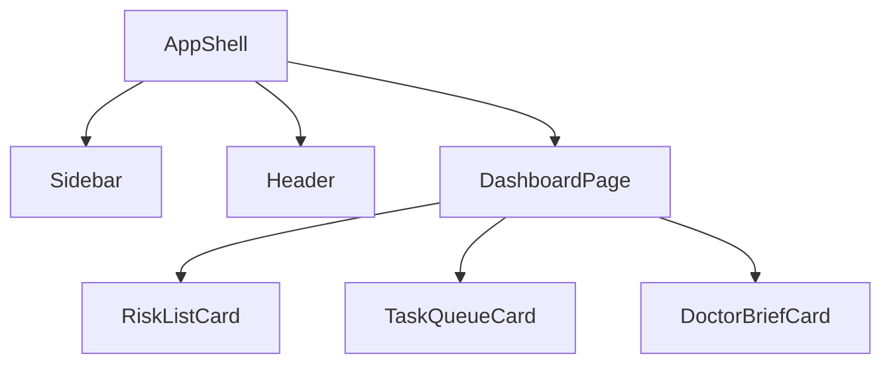

# 06 UI 设计说明

## 背景

Doctor Copilot 是面向院外连续医疗照护场景的 AI Care Platform，需要同时服务医生、护士、患者、管理员四类角色。UI 必须在**信息密度、专业可信、操作效率**之间取得平衡。

## 为什么

一致的页面结构、视觉语言与组件行为，是多人协作开发与长期可维护的基础。医疗场景下，UI 还直接影响：

- 医生能否在晨会前 3 分钟内定位高风险患者
- 护士能否在移动场景下快速完成任务
- 患者能否无负担地理解并执行随访要求
- 管理员能否安全地配置权限与审计策略

## 目标

本文档定义：

1. 设计原则与情绪板
2. 页面结构与信息架构
3. 设计系统入口与文件索引
4. 关键页面的布局与交互概述

## 非目标

- 不定义品牌视觉规范与营销页面。
- 不替代 PRD 中的功能细节。
- 不替代前端组件实现代码。

## 范围

覆盖 Web 端医生/护士工作台、患者详情、消息中心、管理后台的界面规范，并考虑平板与手机端的响应式适配。

## 设计原则

| 原则 | 含义 | 设计表现 |
|---|---|---|
| **清晰优先** | 医疗决策需要快速理解 | 信息分层、强调关键指标、减少视觉噪音 |
| **效率至上** | 医生护士时间碎片化 | 少跳转、常驻入口、批量操作、快捷反馈 |
| **温暖可信** | 降低患者焦虑，建立专业信任 | 中性偏暖色调、柔和圆角、充足留白 |
| **容错友好** | 医疗操作不可误触 | 二次确认、撤销入口、明确状态反馈 |
| **全端一致** | 多角色多设备共用设计语言 | 统一 tokens、响应式断点、一致交互模式 |

## 情绪板

```text
关键词：清澈、稳定、关怀、专业

色彩感受：
- 主色：清澈的蓝绿色（医疗 + 生命力）
- 背景：干净的冷白/浅灰
- 强调：柔和的风险色阶（红 / 橙 / 黄 / 蓝）
- 文字：高对比深灰，避免纯黑压迫感

形态感受：
- 圆角：中等圆角（8-12px），现代但不轻浮
- 阴影：柔和、多层、模拟自然光照
- 排版：清晰的无衬线字体，数值等宽显示
```

## 页面地图


### 一级页面结构

```text
+------------------------------------------+
| Sidebar | Header                         |
|         |--------------------------------|
|         | Main Content                   |
|         | (Cards / Tables / Chat / Form) |
+------------------------------------------+
```

### 页面列表

| 页面 | 主区域 | 主要角色 |
|---|---|---|
| Dashboard | KPI + Risk Queue + To-do + Doctor Brief | 医生、护士 |
| Patient Detail | Timeline + Care Plan + Task + AI Chat | 医生、护士 |
| Message Center | Inbox + Filter + Detail | 医生、护士、患者 |
| Admin | User / Role / AI / Prompt / KB 配置 | 管理员 |

## 文档索引

| 文档 | 说明 |
|---|---|
| [design-tokens.md](./design-tokens.md) | 色彩、字体、间距、圆角、阴影、断点 |
| [layouts.md](./layouts.md) | AppShell、Sidebar、Header、Grid、响应式策略 |
| [components.md](./components.md) | 通用组件规范与状态 |
| [patterns.md](./patterns.md) | 抽屉、筛选、表单、空状态、加载、错误 |
| [accessibility.md](./accessibility.md) | 无障碍、暗色模式、键盘导航 |
| [pages/dashboard.md](./pages/dashboard.md) | Dashboard 详细规范 |
| [pages/patient-detail.md](./pages/patient-detail.md) | 患者详情页规范 |
| [pages/message-center.md](./pages/message-center.md) | 消息中心规范 |
| [pages/admin.md](./pages/admin.md) | 管理后台规范 |

## 组件树（示例）



## 关键交互示例

点击 Risk Queue 某患者后：

1. 右侧抽屉（Drawer）滑出，展示最新 Timeline 事件
2. 抽屉顶部提供「查看患者详情」主按钮
3. 若为 P1 风险，背景以 subtle risk-red 提示
4. 抽屉关闭后自动回到 Dashboard

## 风险

| 风险 | 缓解 |
|---|---|
| 信息密度过高导致可读性下降 | 分层展示 + 渐进展开 + 卡片化布局 |
| 多角色权限导致界面混乱 | 基于角色动态渲染导航与卡片 |
| 暗色模式对比度不足 | 所有颜色通过 WCAG AA 对比度校验 |
| 移动端表格可读性差 | 卡片化列表替代密集表格 |

## Future Work

- 增加移动端原生交互模式（手势、底部 Sheet）
- 增加无障碍语音朗读与焦点管理专项测试
- 建立设计系统 Figma 组件库与代码组件的双向同步
