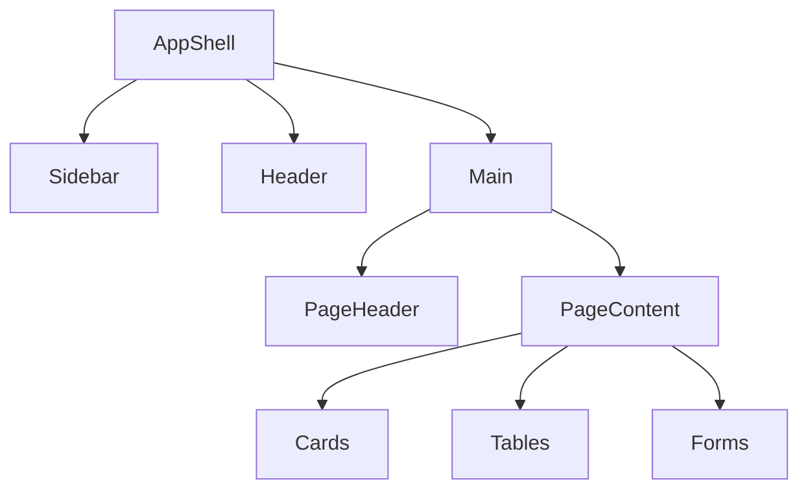

# Layouts 布局规范

## 概述

Doctor Copilot 采用经典的 **Sidebar + Header + Main Content** 三段式布局。所有内部页面共享统一的 `AppShell`，确保用户在不同角色、不同设备间获得一致的导航与操作体验。

布局设计的核心目标：

- 医生/护士可快速在 Dashboard、患者、任务、消息间切换
- 高密度信息场景下保持主内容区足够宽敞
- 移动端通过折叠 Sidebar、调整内容网格适配小屏

## AppShell 结构



### 整体框架（桌面端展开态）

```text
+----------------------------------------------------------+
|  Logo    Dashboard  Patients  Tasks  Alerts  AI  Admin  |  ← Header
|----------------------------------------------------------|
| Sidebar | Breadcrumb / Page Title        [Actions]  User |  ← Page Header
|         |-----------------------------------------------|
|         |                                               |
|         |              Main Content                     |
|         |           (Cards / Tables / Forms)            |
|         |                                               |
+----------------------------------------------------------+
```

### 整体框架（移动端）

```text
+----------------------------------+
|  ≡  Logo              🔔  👤     |  ← Header（汉堡菜单 + 全局操作）
|----------------------------------|
|  Breadcrumb / Page Title         |
|----------------------------------|
|                                  |
|         Main Content             |
|      (Stacked Cards / Lists)     |
|                                  |
+----------------------------------+
```

## Sidebar 导航

### 基础规则

- 桌面端默认展开，宽度 `240px`
- 用户可折叠为 `64px` 图标栏，状态持久化到 localStorage
- 当前页面高亮，使用 `--color-bg-selected` 背景 + `--color-primary-700` 文字
- 未授权菜单项根据角色权限隐藏，禁用状态仅用于临时功能降级

### 导航项结构

| 层级 | 说明 |
|---|---|
| 一级导航 | 常驻于 Sidebar，对应独立页面 |
| 二级导航 | 折叠在一级导航下，或作为页面内 Tab 呈现 |
| 角标 | 消息、待办、风险使用 Badge 展示数量 |

### 角色化导航

| 角色 | 可见一级导航 |
|---|---|
| 医生 | Dashboard、Patients、Tasks、Alerts、Doctor Brief、Messages |
| 护士 | Dashboard、Patients、Tasks、Alerts、Messages |
| 患者 | Tasks、Messages、Feedback（若开放） |
| 管理员 | Dashboard、Users、Roles、Permissions、AI Config、Prompts、KB、Audit |

### Sidebar 折叠态

```text
+--+
|🏥|  ← Logo 图标
+--+
|📊|  ← Dashboard（Tooltip 显示文字）
|👤|
|✅|
|🔔|
|💬|
+--+
|⚙️|
+--+
```

### 移动端 Sidebar

- 通过汉堡菜单触发
- 以 Drawer 形式从左侧滑出，宽度 `280px`
- 点击遮罩或导航项后自动关闭
- 底部展示当前用户简档与退出入口

## Header 顶栏

### 桌面端 Header

```text
+------------------------------------------------------------------+
| [Search]        [🔔 12]  [❓ Help]  [Avatar 张医生 ▼]            |
+------------------------------------------------------------------+
```

### 移动端 Header

```text
+----------------------------------+
| ≡  |  Doctor Copilot   | 🔔 | 👤 |
+----------------------------------+
```

### Header 元素

| 元素 | 位置 | 说明 |
|---|---|---|
| 汉堡菜单 | 左侧 | 仅移动端显示，展开 Sidebar |
| Logo / 产品名 | 左侧 | 点击返回 Dashboard |
| 全局搜索 | 中间 | 快捷键 `Cmd/Ctrl + K`，支持患者、任务、文档搜索 |
| 通知铃铛 | 右侧 | 点击展开通知 Dropdown，未读数用 Badge |
| 帮助入口 | 右侧 | 链接到文档或唤起 AI 助手 |
| 用户菜单 | 右侧 | 头像 + 下拉：个人设置、暗色模式、退出 |

## Page Header 页面标题区

每个页面主内容区顶部包含：

```text
+----------------------------------------------------------+
| Dashboard                        [+ 新建任务] [导出]      |
| 今日待处理 12 项，P1 风险 2 人                              |
+----------------------------------------------------------+
```

| 元素 | 规则 |
|---|---|
| Breadcrumb | 深度 ≥ 2 时显示，例如 `Dashboard / Patients / 张三` |
| 页面标题 | `--text-2xl`，`--font-semibold` |
| 页面描述 | `--text-sm`，`--color-text-tertiary`，可选 |
| 页面级操作 | 右对齐，主按钮 + 次按钮组合 |

## 主内容区（Main Content）

### 容器规则

- 最大宽度：`1440px`，居中
- 页面内边距：移动端 `16px`，桌面端 `24px`（`xl` 以上 `32px`）
- 内容区最小高度：`calc(100vh - Header 高度 - PageHeader 高度)`

### 栅格系统

基于 CSS Grid，使用 12 列栅格：

```css
.page-content {
  display: grid;
  grid-template-columns: repeat(12, minmax(0, 1fr));
  gap: 24px;
}
```

常用列宽组合：

| 布局 | 桌面端 | 平板端 | 移动端 |
|---|---|---|---|
| 两列等宽 | `col-span-6` × 2 | `col-span-6` × 2 | `col-span-12` |
| 左窄右宽 | `col-span-4` + `col-span-8` | `col-span-5` + `col-span-7` | 堆叠 |
| 三列等宽 | `col-span-4` × 3 | `col-span-6` × 2 + `col-span-12` | 堆叠 |
| 四列 KPI | `col-span-3` × 4 | `col-span-6` × 2 | `col-span-6` × 2 |

## 响应式布局策略

### 断点行为总览

| 元素 | `< 768px` | `768px - 1023px` | `≥ 1024px` |
|---|---|---|---|
| Sidebar | 隐藏，Drawer 触发 | 可选折叠图标栏 | 展开 `240px` |
| Header | 仅 Logo、搜索图标、通知、用户 | 完整搜索框 | 完整搜索框 |
| 页面 Padding | `16px` | `24px` | `24px` / `32px` |
| 卡片布局 | 单列堆叠 | 1-2 列 | 2-4 列 |
| 表格 | 卡片化列表 | 简化表格 | 完整表格 |
| 抽屉 | 全屏 Bottom Sheet | 右侧 `400px` | 右侧 `480px-560px` |

### 关键原则

1. **Mobile First**：基础样式针对移动端编写，通过断点逐步增强。
2. **内容优先**：小屏时优先展示关键操作与核心数据，次要信息放入抽屉或折叠。
3. **触控友好**：移动端按钮最小触控区域 `44px × 44px`，卡片间距 ≥ `16px`。
4. **避免横向滚动**：表格在移动端必须转换为卡片列表或横向滚动仅作为兜底方案。

## 页面布局示例

### Dashboard 布局

```text
Desktop:
┌─────┬─────────────────────────────────────────────┐
│     │ [KPI 1] [KPI 2] [KPI 3] [KPI 4]             │
│     ├──────────────────────┬──────────────────────┤
│Side │ Risk Queue           │ To-do Queue          │
│bar  ├──────────────────────┼──────────────────────┤
│     │ Doctor Brief         │ Quick Actions        │
│     └──────────────────────┴──────────────────────┘

Tablet:
┌────┬──────────────────────────────┐
│Side│ [KPI 1] [KPI 2]              │
│bar │ [KPI 3] [KPI 4]              │
│    ├──────────────────────────────┤
│    │ Risk Queue    │ To-do Queue  │
│    ├──────────────────────────────┤
│    │ Doctor Brief  │ Quick Actions│
└────┴──────────────────────────────┘

Mobile:
┌─────────────────┐
│ Header          │
├─────────────────┤
│ [KPI 1] [KPI 2] │
│ [KPI 3] [KPI 4] │
│ Risk Queue      │
│ To-do Queue     │
│ Doctor Brief    │
│ Quick Actions   │
└─────────────────┘
```

### Patient Detail 布局

```text
Desktop:
┌─────┬──────────────────────────────────────────────────────┐
│     │ 患者基本信息卡                                        │
│     ├──────────────────────────────────────────────────────┤
│Side │ [Timeline] [Care Plan] [Tasks] [AI Chat]  ← Tab Nav  │
│bar  ├──────────────────────────────────────────────────────┤
│     │ Tab Content                                          │
│     │  - Timeline: 时间轴                                  │
│     │  - Care Plan: 计划卡片网格                            │
│     │  - Tasks: 任务列表                                   │
│     │  - AI Chat: 聊天面板                                 │
└─────┴──────────────────────────────────────────────────────┘

Mobile:
┌─────────────────┐
│ Header          │
├─────────────────┤
│ 患者基本信息卡   │
│ [Tab 滑动选择]   │
│ Tab Content     │
└─────────────────┘
```

## 布局组件清单

| 组件 | 路径建议 | 说明 |
|---|---|---|
| `AppShell` | `components/layout/app-shell.tsx` | 外层布局容器 |
| `Sidebar` | `components/layout/sidebar.tsx` | 左侧导航 |
| `SidebarItem` | `components/layout/sidebar-item.tsx` | 导航项 |
| `Header` | `components/layout/header.tsx` | 顶部栏 |
| `PageHeader` | `components/layout/page-header.tsx` | 页面标题区 |
| `MainContent` | `components/layout/main-content.tsx` | 主内容区容器 |
| `MobileDrawer` | `components/layout/mobile-drawer.tsx` | 移动端抽屉 |

## 布局相关 Tokens

| Token | Value | 用途 |
|---|---|---|
| `--layout-sidebar-width` | `240px` | Sidebar 展开宽度 |
| `--layout-sidebar-collapsed-width` | `64px` | Sidebar 折叠宽度 |
| `--layout-header-height` | `64px` | Header 高度 |
| `--layout-page-header-height` | `72px` | PageHeader 高度 |
| `--layout-main-max-width` | `1440px` | 主内容最大宽度 |
| `--layout-sidebar-bg` | `#FFFFFF` | Sidebar 背景 |
| `--layout-header-bg` | `#FFFFFF` | Header 背景 |
| `--layout-header-border` | `#E2E8F0` | Header 底部分隔线 |
