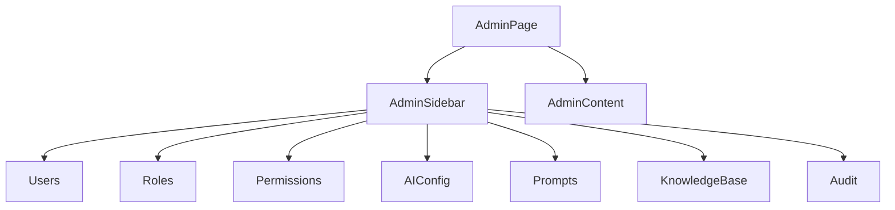

# Admin 管理后台规范

## 概述

管理后台面向管理员，用于用户管理、角色权限、AI 配置、Prompt 管理、知识库配置与审计。设计重点是**安全、可控、可追踪**，界面以表格、表单、配置面板为主。

## 页面目标

- 管理员可高效管理用户、角色、权限
- AI 配置与 Prompt 管理清晰可维护
- 知识库内容可检索、可审核
- 审计日志可追溯

## 非目标

- 不面向医生/护士/患者日常使用
- 不替代代码级配置管理

## 页面结构



### 桌面端布局

```text
┌─────────────────────────────────────────────────────────────┐
│ Admin                                          [?] [👤]     │
├──────────┬──────────────────────────────────────────────────┤
│ Users    │ 用户管理                              [+ 新建用户]│
│ Roles    │                                                  │
│ Permissions│ ┌────────────────────────────────────────────┐ │
│ AI Config│ │ 搜索...  [筛选] [导出]                        │ │
│ Prompts  │ ├────────────────────────────────────────────┤ │
│ KB       │ │ 姓名    角色    状态    最近登录    操作      │ │
│ Audit    │ │ 张三    医生    启用    2 分钟前   [编辑][禁用]│ │
│          │ │ 李四    护士    启用    1 小时前   [编辑][禁用]│ │
│          │ └────────────────────────────────────────────┤ │
│          │ [共 128 条]  [< 1 2 3 ... 10 >]               │
└──────────┴──────────────────────────────────────────────────┘
```

### 移动端布局

```text
┌─────────────────────────────┐
│ Admin             [⋮]       │
├─────────────────────────────┤
│ [当前模块 ▼]                 │
├─────────────────────────────┤
│ [搜索...] [筛选]             │
├─────────────────────────────┤
│ 用户卡片列表                  │
│ ┌─────────────────────────┐ │
│ │ 张三  医生  启用         │ │
│ │ 最近登录：2 分钟前       │ │
│ │ [编辑] [禁用]            │ │
│ └─────────────────────────┘ │
└─────────────────────────────┘
```

## Admin 二级导航

| 模块 | 功能 | 主要组件 |
|---|---|---|
| 用户管理 | 创建/编辑/禁用用户，重置密码 | Table、Form、Modal |
| 角色管理 | 定义角色与权限集合 | Table、Transfer、Form |
| 权限管理 | 细粒度权限配置 | Tree、Table |
| AI 配置 | 模型参数、路由规则、开关 | Form、Card |
| Prompt 管理 | Prompt 版本、测试、发布 | Table、Editor、Test Panel |
| 知识库 | 文档上传、分块、检索测试 | Upload、Table、Search |
| 审计日志 | 操作记录、筛选、导出 | Table、Filter、DatePicker |

## 通用列表页模式

管理后台所有列表页采用统一模式：

```text
┌─────────────────────────────────────────────────────────────┐
│ 模块标题                              [+ 新建] [导入] [导出] │
├─────────────────────────────────────────────────────────────┤
│ [搜索...] [状态 ▼] [时间 ▼] [更多筛选]              [重置]  │
├─────────────────────────────────────────────────────────────┤
│ Table / Card List                                           │
├─────────────────────────────────────────────────────────────┤
│ 共 N 条                              [分页]                 │
└─────────────────────────────────────────────────────────────┘
```

### 工具栏

- 左侧：搜索 + 筛选
- 右侧：新建、导入、导出
- 批量选择后替换为批量操作栏

### 表格

- 默认 10 条/页，可选 20/50/100
- 支持排序、列宽调整
- 关键状态列使用 Badge
- 操作列固定右侧

### 分页

- 桌面端：页码分页
- 移动端：无限滚动或简单上一页/下一页

## 用户管理

### 用户列表

| 字段 | 说明 |
|---|---|
| 姓名 | 用户真实姓名 |
| 账号 / 邮箱 | 登录账号 |
| 角色 | 医生/护士/患者/管理员 |
| 状态 | 启用 / 禁用 / 待激活 |
| 最近登录 | 相对时间 |
| 操作 | 编辑、禁用、重置密码 |

### 新建/编辑用户

- Modal `md` 尺寸
- 字段：姓名、邮箱、角色、科室、手机号、状态
- 提交前校验邮箱唯一性

## 角色与权限

### 角色列表

- 展示角色名称、关联用户数、创建时间
- 支持复制角色、删除角色（无用户时）

### 权限配置

- 使用树形结构展示权限点
- 支持按模块批量勾选
- 变更权限时提示影响范围

```text
┌─────────────────────────────────┐
│ 医生角色权限                     │
│ ☑ 患者管理                       │
│   ☑ 查看患者                     │
│   ☑ 编辑患者                     │
│   ☐ 删除患者                     │
│ ☑ 任务管理                       │
│ ☑ AI 助手                        │
│ ☐ 系统配置                       │
└─────────────────────────────────┘
```

## AI 配置

### 配置分组

| 分组 | 内容 |
|---|---|
| 模型设置 | 默认模型、温度、最大 Token |
| 路由规则 | 按场景路由到不同模型 |
| 安全策略 | 内容过滤、敏感词、审计级别 |
| 功能开关 | RAG、流式输出、AI 建议 |

### 配置项展示

- 使用 Card 分组
- 危险配置（如关闭安全策略）需二次确认
- 变更后提示「配置已保存」

## Prompt 管理

### Prompt 列表

| 字段 | 说明 |
|---|---|
| 名称 | Prompt 名称 |
| 场景 | 用于哪个功能 |
| 版本 | 当前版本号 |
| 状态 | 草稿 / 已发布 |
| 更新时间 | 相对时间 |
| 操作 | 编辑、测试、发布 |

### Prompt 编辑器

- 文本域高度自适应
- 支持变量占位符高亮 `{{variable}}`
- 右侧测试面板实时预览

```text
┌──────────────────────────────┬──────────────────────────────┐
│ Prompt 编辑器                 │ 测试面板                      │
│                              │                              │
│ 你是一位资深医生助手...       │ 输入测试数据...               │
│                              │ [运行]                        │
│ {{patient_name}} 的病情...   │                              │
│                              │ 输出结果：                    │
│                              │ ...                          │
└──────────────────────────────┴──────────────────────────────┘
```

## 知识库

### 文档列表

- 展示文档名称、类型、分块数、状态、更新时间
- 支持上传、重新解析、删除

### 检索测试

- 输入查询语句
- 展示 Top-K 检索结果与相似度分数
- 支持调整检索参数

## 审计日志

### 日志列表

| 字段 | 说明 |
|---|---|
| 时间 | 精确到秒 |
| 用户 | 操作人 |
| 操作 | 操作类型 |
| 对象 | 被操作资源 |
| IP | 操作来源 |
| 结果 | 成功 / 失败 |

### 筛选

- 按时间范围、用户、操作类型、结果筛选
- 支持导出 CSV

## 响应式策略

| 断点 | 布局 |
|---|---|
| `< 768px` | 二级导航折叠为下拉，表格卡片化 |
| `768px - 1023px` | 二级导航侧边栏固定 200px |
| `≥ 1024px` | 二级导航侧边栏固定 240px |

## 安全与确认

### 危险操作

| 操作 | 确认方式 |
|---|---|
| 禁用用户 | Modal 确认 |
| 删除角色 | Modal 确认 + 输入角色名 |
| 变更权限 | Modal 确认 + 提示影响用户数 |
| 删除知识库文档 | Modal 确认 |
| 修改 AI 安全策略 | Modal 确认 + 说明风险 |

## 加载与空状态

| 场景 | 状态 |
|---|---|
| 列表加载 | 表格 Skeleton |
| 无数据 | 「暂无数据」+ 新建入口 |
| 筛选无结果 | 「无符合条件的数据」+ 清除筛选 |
| 保存配置 | Toast + 按钮 Loading |

## 相关文档

- [PRD-12 Admin](../01-prd/12-admin.md)
- [PRD-13 Permission](../01-prd/13-permission.md)
- [PRD-16 AI Config](../01-prd/16-ai-config.md)
- [PRD-17 Prompt Management](../01-prd/17-prompt-management.md)
- [PRD-18 Knowledge Base](../01-prd/18-knowledge-base.md)
