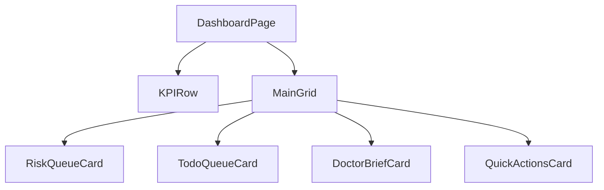

# Dashboard 页面规范

## 概述

Dashboard 是医生/护士每日进入系统后的主工作台。设计目标是在**首屏 3 分钟内**让用户定位关键任务与风险患者，避免信息过载。

## 页面目标

- 展示待办任务、风险患者、关键指标与快捷入口
- 支持医生晨会前快速决策
- 支持护士快速执行当日任务

## 非目标

- 不在 Dashboard 承载所有详情编辑
- 不替代患者详情页的完整信息

## 页面结构



### 桌面端布局

```text
┌─────────────────────────────────────────────────────────────┐
│ Dashboard                              [+ 新建任务] [导出]   │
│ 今日待处理 12 项，P1 风险 2 人                                 │
├─────────────────────────────────────────────────────────────┤
│ [KPI: 在管患者] [KPI: 今日任务] [KPI: P1 风险] [KPI: 待回复] │
├──────────────────────────────┬──────────────────────────────┤
│ Risk Queue                   │ To-do Queue                  │
│ ┌──────────────────────────┐ │ ┌──────────────────────────┐ │
│ │ ⚠️ P1 张三 血压异常       │ │ │ ☐ 完成张三随访            │ │
│ │ ▲ P2 李四 血糖偏高        │ │ │ ☐ 提醒李四上传指标        │ │
│ │ ● P3 王五 用药依从低      │ │ │ ☐ 审核赵六反馈            │ │
│ └──────────────────────────┘ │ └──────────────────────────┘ │
├──────────────────────────────┼──────────────────────────────┤
│ Doctor Brief                 │ Quick Actions                │
│ ┌──────────────────────────┐ │ ┌──────────────────────────┐ │
│ │ 过去 24h 关键变化         │ │ │ [+ 新建随访]              │ │
│ │ • 张三 BP 160/100        │ │ │ [+ 发送提醒]              │ │
│ │ • 李四 新增 2 条反馈     │ │ │ [+ 查看报告]              │ │
│ └──────────────────────────┘ │ └──────────────────────────┘ │
└──────────────────────────────┴──────────────────────────────┘
```

### 移动端布局

```text
┌─────────────────────────────┐
│ Dashboard                   │
├─────────────────────────────┤
│ [KPI 1] [KPI 2]             │
│ [KPI 3] [KPI 4]             │
├─────────────────────────────┤
│ Risk Queue                  │
│ [风险患者卡片列表]            │
├─────────────────────────────┤
│ To-do Queue                 │
│ [任务卡片列表]               │
├─────────────────────────────┤
│ Doctor Brief                │
│ [关键变化列表]               │
├─────────────────────────────┤
│ Quick Actions               │
│ [操作按钮网格]               │
└─────────────────────────────┘
```

## 模块详细规范

### KPI 行

- 4 个 KPI 卡片横向排列，移动端 2×2
- 每个 KPI 展示：标签、数值、环比、趋势图标
- 数值使用 `--font-mono`，`--text-3xl`
- 可点击，跳转对应详情页

| KPI | 指标 | 正常范围 | 异常表现 |
|---|---|---|---|
| 在管患者 | 当前管理患者总数 | - | - |
| 今日任务 | 今日待完成任务数 | ≤ 20 | > 20 时黄色提醒 |
| P1 风险 | 当前 P1 风险患者数 | 0 | > 0 时红色高亮 |
| 待回复 | 患者消息待回复数 | ≤ 5 | > 5 时黄色提醒 |

### Risk Queue 风险队列

- 按风险等级 P1 → P4 排序，同等级按时间倒序
- 每行展示：风险标识、患者姓名、风险描述、最后更新时间、操作按钮
- P1/P2 行使用对应风险背景色
- 点击行打开右侧 Drawer，展示最新 Timeline 与快捷操作

```text
Risk Queue 卡片
┌─────────────────────────────────┐
│ Risk Queue           [查看全部 →]│
├─────────────────────────────────┤
│ ┌─ 患者行（P1 背景）            │
│ │ ⚠️ 极高  张三  血压 160/100  │
│ │         2 分钟前    [查看]    │
│ └─                             │
│ ┌─ 患者行（P2 背景）            │
│ │ ▲ 高  李四  血糖 11.2        │
│ │      15 分钟前    [查看]      │
│ └─                             │
└─────────────────────────────────┘
```

### To-do Queue 待办队列

- 按截止时间升序排列
- 每行展示：Checkbox、任务名称、患者、截止时间、优先级
- 支持行内快速完成
- 过期任务用 `--color-error-500` 标注时间

```text
To-do Queue 卡片
┌─────────────────────────────────┐
│ To-do Queue          [查看全部 →]│
├─────────────────────────────────┤
│ ☐ 完成张三随访      09:30 [P1]  │
│ ☐ 提醒李四上传指标  10:00 [P2]  │
│ ☐ 审核赵六反馈      11:00 [P3]  │
│ ☐ 更新钱七护理计划  14:00 [P4]  │
└─────────────────────────────────┘
```

### Doctor Brief 医生摘要

- 聚合过去 24h 关键变化
- 每条 Brief 包含：变化类型、患者、简述、时间
- 点击跳转患者详情页对应 Tab
- 空状态提示「过去 24 小时无关键变化」

### Quick Actions 快捷操作

- 3-4 个高频操作入口
- 使用图标 + 文字的卡片按钮
- 移动端可横向滚动或换行网格

| 操作 | 图标 | 跳转 |
|---|---|---|
| 新建随访 | Plus | 新建任务页/抽屉 |
| 发送提醒 | Bell | 消息中心 |
| 查看报告 | FileText | 报告页 |
| AI 助手 | Sparkles | AI Chat 抽屉 |

## 交互细节

### 点击 Risk Queue 行

1. 右侧 Drawer 滑出
2. 顶部展示患者基本信息 + 风险等级
3. 中部展示最新 3 条 Timeline 事件
4. 底部提供「查看患者详情」按钮
5. Drawer 内可直接标记「已处理」

### 点击 To-do 完成

1. Checkbox 变为 Loading
2. 完成后该行淡出，后续行上移
3. Toast 提示「任务已完成」
4. KPI 数值实时更新

### 页面刷新

- 进入页面时并行加载各模块
- 每 60 秒自动刷新风险队列与待办
- 刷新时显示最后更新时间

## 空状态

| 模块 | 空状态 |
|---|---|
| Risk Queue | 「暂无高风险患者」+ 查看全部患者入口 |
| To-do Queue | 「今日任务已完成」+ 新建任务入口 |
| Doctor Brief | 「过去 24 小时无关键变化」 |

## 加载状态

- 页面整体使用 Skeleton
- 每个卡片独立 Skeleton，避免整页空白
- KPI 使用矩形占位，队列使用 3 行占位

## 响应式策略

| 断点 | 布局 |
|---|---|
| `< 768px` | 单列堆叠，KPI 2×2，所有卡片全宽 |
| `768px - 1023px` | 两列布局，KPI 4 列 |
| `≥ 1024px` | 两列主网格，KPI 4 列 |

## 相关文档

- [PRD-02 Dashboard](../01-prd/02-dashboard.md)
- [PRD-09 Doctor Brief](../01-prd/09-doctor-brief.md)
- [PRD-08 Alert](../01-prd/08-alert.md)
