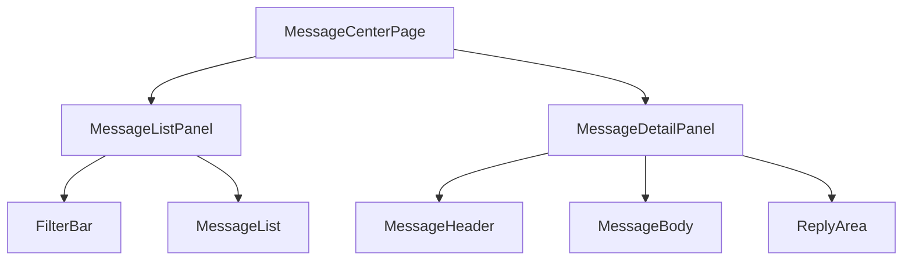

# Message Center 消息中心规范

## 概述

消息中心聚合系统通知、患者消息、任务提醒与 AI 建议。设计目标是让医生/护士/患者三类角色快速识别重要信息并处理，避免消息遗漏。

## 页面目标

- 统一展示所有消息来源
- 支持按类型、时间、已读状态筛选
- 支持快速回复患者、标记已读

## 非目标

- 不替代实时音视频通话
- 不替代复杂工单系统

## 页面结构



### 桌面端布局

```text
┌─────────────────────────────────────────────────────────────┐
│ 消息中心                                                    │
├────────────────────┬────────────────────────────────────────┤
│ [全部 ▼] [未读 ▼]  │ 张三（高血压随访）            [⋮]       │
│ ┌────────────────┐ │────────────────────────────────────────│
│ │ 🔴 张三         │ │                                        │
│ │  血压有点高，需要│ │  患者消息内容...                        │
│ │  调整药吗？     │ │                                        │
│ │  10:23         │ │  ─────────────────────                  │
│ └────────────────┘ │ │  [回复输入框]            [发送]        │
│ ┌────────────────┐ │                                        │
│ │ 🟢 系统通知     │ │                                        │
│ │  李四完成今日随 │ │                                        │
│ │  访任务         │ │                                        │
│ │  09:45         │ │                                        │
│ └────────────────┘ │                                        │
└────────────────────┴────────────────────────────────────────┘
```

### 移动端布局

```text
┌─────────────────────────────────┐
│ 消息中心              [筛选]    │
├─────────────────────────────────┤
│ ┌─────────────────────────────┐ │
│ │ 🔴 张三  10:23              │ │
│ │ 血压有点高，需要调整药吗？   │ │
│ └─────────────────────────────┘ │
│ ┌─────────────────────────────┐ │
│ │ 🟢 系统通知  09:45          │ │
│ │ 李四完成今日随访任务         │ │
│ └─────────────────────────────┘ │
└─────────────────────────────────┘
```

点击消息后进入详情页/抽屉。

## 消息列表

### 列表项结构

```text
┌─────────────────────────────────┐
│ [Avatar] 张三              [🔴] │
│ 血压有点高，需要调整药吗？       │
│ 10:23    [高血压随访] [P1]      │
└─────────────────────────────────┘
```

### 信息层级

| 层级 | 内容 | 样式 |
|---|---|---|
| 主信息 | 发送者、消息摘要 | `--text-base`，未读 `--font-semibold` |
| 次信息 | 时间、关联患者/任务 | `--text-xs`，`--color-text-tertiary` |
| 标签 | 消息类型、风险等级 | `Badge` |

### 消息类型

| 类型 | 图标颜色 | 来源 |
|---|---|---|
| 患者消息 | 蓝色 | 患者 |
| 系统通知 | 绿色 | 系统 |
| 任务提醒 | 橙色 | Task Engine |
| 风险预警 | 红色 | Alert Engine |
| AI 建议 | 紫色 | AI Copilot |

## 筛选栏

### 筛选维度

| 维度 | 选项 |
|---|---|
| 消息类型 | 全部 / 患者 / 系统 / 任务 / 风险 / AI |
| 阅读状态 | 全部 / 未读 / 已读 |
| 时间范围 | 今天 / 最近 7 天 / 最近 30 天 |
| 风险等级 | 全部 / P1 / P2 / P3 / P4 |

### 搜索

- 支持按患者姓名、消息内容搜索
- 搜索框位于筛选栏右侧

## 消息详情

### 桌面端详情面板

- 固定宽度 `480px` 或占据右侧 60%
- 顶部：发送者信息 + 操作菜单
- 中部：消息内容 + 关联上下文
- 底部：回复输入框

### 详情头部

```text
┌─────────────────────────────────────────────────────────────┐
│ [Avatar] 张三                                 [已读] [⋮]    │
│ 患者 · 高血压随访 · P1                                      │
└─────────────────────────────────────────────────────────────┘
```

### 消息内容区

- 患者消息以对话气泡展示
- 系统通知以卡片展示
- AI 建议展示结构化建议 + 操作按钮

### 回复区

- 输入框高度自适应
- 支持快捷回复模板
- 支持 @ 提及患者或任务

## 快捷操作

### 列表项操作

| 操作 | 触发 | 说明 |
|---|---|---|
| 标记已读 | Hover 出现 / 长按 | 未读变已读 |
| 删除 | 更多菜单 | 仅删除本地消息记录 |
| 置顶 | 更多菜单 | 重要消息置顶 |

### 批量操作

- 支持多选消息
- 批量标记已读/未读
- 批量删除

## 通知角标

- Header 铃铛图标显示未读数量
- 数量 > 99 时显示「99+」
- 新消息到达时 subtle 动画提示

## 响应式策略

| 断点 | 布局 |
|---|---|
| `< 768px` | 列表全屏，点击后进入新页面或全屏 Drawer |
| `768px - 1023px` | 列表 40% + 详情 60% |
| `≥ 1024px` | 列表 360px + 详情自适应 |

## 加载与空状态

| 场景 | 状态 |
|---|---|
| 消息加载 | 列表 Skeleton 5 条 |
| 无消息 | 「暂无消息」+ 返回 Dashboard |
| 筛选无结果 | 「没有符合条件的消息」+ 清除筛选 |
| 无未读 | 铃铛角标隐藏 |

## 相关文档

- [PRD-11 Notification](../01-prd/11-notification.md)
- [PRD-14 Message Center](../01-prd/14-message-center.md)
