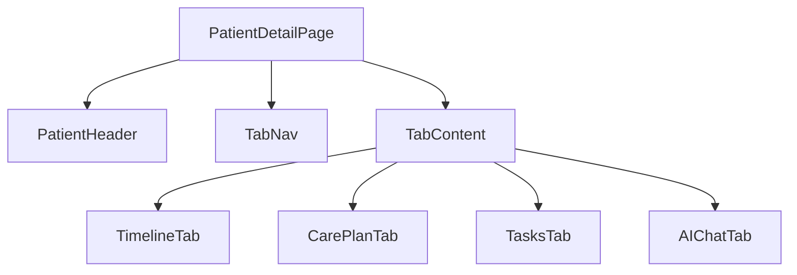

# Patient Detail 患者详情页规范

## 概述

患者详情页是医生/护士查看、管理与跟进单个患者的核心页面。所有与该患者相关的信息（Timeline、Care Plan、Tasks、AI Chat）通过 Tab 组织，避免跨模块跳转。

## 页面目标

- 在同一页面完整呈现患者照护全貌
- 支持快速切换不同维度信息
- 支持医生做决策、护士执行任务、AI 辅助

## 非目标

- 不替代管理员的用户管理功能
- 不替代报告导出后的离线查看

## 页面结构



### 桌面端布局

```text
┌─────────────────────────────────────────────────────────────┐
│ 患者详情                                      [编辑] [⋯]    │
├─────────────────────────────────────────────────────────────┤
│ ┌─[Avatar] 张三  男  68岁  高血压  糖尿病───────────────┐  │
│ │ 电话：138****8888  标签：高风险  最近更新：10 分钟前    │  │
│ └─────────────────────────────────────────────────────────┘  │
├─────────────────────────────────────────────────────────────┤
│ [Timeline] [Care Plan] [Tasks] [AI Chat]                    │
├─────────────────────────────────────────────────────────────┤
│                                                             │
│                        Tab Content                          │
│                                                             │
└─────────────────────────────────────────────────────────────┘
```

### 移动端布局

```text
┌─────────────────────────────┐
│ 患者详情          [编辑]    │
├─────────────────────────────┤
│ [Avatar] 张三  男  68岁     │
│ 高血压 · 糖尿病              │
├─────────────────────────────┤
│ [Timeline ▼]                │
├─────────────────────────────┤
│ Tab Content                 │
│                             │
└─────────────────────────────┘
```

## 患者信息头（Patient Header）

### 信息层级

| 层级 | 内容 | 样式 |
|---|---|---|
| 主信息 | 姓名、性别、年龄 | `--text-2xl`，`--font-semibold` |
| 次信息 | 诊断标签、风险等级 | `--text-sm`，Badge |
| 辅助信息 | 电话、最近更新时间 | `--text-sm`，`--color-text-tertiary` |

### 诊断标签

- 使用 `Badge` 组件，默认变体
- 多个诊断横向排列，间距 `8px`
- 最多展示 3 个，超出折叠为「+2」

### 操作按钮

| 操作 | 变体 | 说明 |
|---|---|---|
| 编辑资料 | `secondary` | 打开编辑 Drawer |
| 更多 | `ghost` + 图标 | Dropdown：删除、导出、打印 |

## Tab 导航

### Tab 列表

| Tab | 内容 | 主要角色 |
|---|---|---|
| Timeline | 患者事件时间轴 | 医生、护士 |
| Care Plan | 照护计划与指标 | 医生、护士 |
| Tasks | 任务列表与创建 | 医生、护士 |
| AI Chat | AI 助手对话 | 医生、护士 |

### Tab 行为

- 默认选中 Timeline
- Tab 切换时 URL hash 同步（`#timeline`、`#care-plan`）
- 刷新页面后保持当前 Tab

## Timeline 时间轴

### 时间轴结构

```text
┌─────────────────────────────────────────────────────────────┐
│ 2024-07-12                                                  │
│ ●──────── 09:30  血压异常 alert                              │
│ │            P1  收缩压 160mmHg，需立即关注                 │
│ │            [查看详情]                                      │
│ ●──────── 08:15  患者上传空腹血糖                            │
│              血糖 7.2mmol/L，在正常范围                      │
│                                                             │
│ 2024-07-11                                                  │
│ ●──────── 20:00  服药提醒已发送                              │
│              患者已确认                                      │
└─────────────────────────────────────────────────────────────┘
```

### 时间轴节点

- 节点类型用颜色和图标区分：
  - Alert：红色圆点 + 感叹号
  - Observation：蓝色圆点
  - Task：绿色圆点 + 对勾
  - Message：灰色圆点 + 消息图标
  - AI Insight：紫色圆点 + Sparkles

### 交互

- 点击节点展开详情
- 支持按事件类型筛选
- 支持按日期快速跳转

## Care Plan 照护计划

### 布局

- 左侧/顶部：计划概览卡片
- 右侧/下方：指标趋势卡片

```text
┌──────────────────────────────┬──────────────────────────────┐
│ 当前计划                      │ 关键指标趋势                  │
│ ┌──────────────────────────┐ │ ┌──────────────────────────┐ │
│ │ 高血压管理计划            │ │ [血压趋势图]               │ │
│ │ 目标：BP < 140/90         │ │                            │ │
│ │ 周期：2024.07 - 2024.12   │ │ [血糖趋势图]               │ │
│ │ [查看完整计划]            │ │                            │ │
│ └──────────────────────────┘ │ └──────────────────────────┘ │
├──────────────────────────────┴──────────────────────────────┤
│ 指标目标列表                                                  │
│ ┌─────────────────────────────────────────────────────────┐ │
│ │ 血压    目标 < 140/90    当前 160/100    [记录]          │ │
│ │ 血糖    目标 4.4-7.0     当前 7.2        [记录]          │ │
│ └─────────────────────────────────────────────────────────┘ │
└─────────────────────────────────────────────────────────────┘
```

### 计划卡片

- 标题：计划名称
- 元信息：目标、周期、负责人
- 状态 Badge：进行中、已完成、暂停

### 指标卡片

- 展示最近 7/30/90 天趋势
- 异常点标注风险色
- 支持放大查看

## Tasks 任务

### 布局

- 顶部：新建任务按钮 + 筛选器
- 中部：任务列表/表格

### 任务列表项

```text
┌─────────────────────────────────────────────────────────────┐
│ ☐ 完成张三随访               [P1]  今天 09:30  [完成] [⋯]   │
│    随访类型：电话随访  负责人：李护士                          │
└─────────────────────────────────────────────────────────────┘
```

### 状态

| 状态 | Badge |
|---|---|
| 待处理 | `warning` |
| 进行中 | `primary` |
| 已完成 | `success` |
| 已逾期 | `error` |

### 交互

- 点击行展开任务详情
- 支持行内完成
- 支持批量选择

## AI Chat

### 布局

- 左侧/全屏：消息气泡列表
- 底部：输入框 + 快捷问题

```text
┌─────────────────────────────────────────────────────────────┐
│                                                             │
│  🤖 你好，张三最近 3 天血压偏高，建议关注。                  │
│                                                             │
│  收到，原因可能是什么？                                     │
│                                                             │
│  🤖 可能与近期钠盐摄入增加、服药依从性下降有关...          │
│                                                             │
├─────────────────────────────────────────────────────────────┤
│ [快捷问题：查看血压趋势] [查看用药记录] [生成随访建议]      │
├─────────────────────────────────────────────────────────────┤
│ [输入问题...]                      [发送]                   │
└─────────────────────────────────────────────────────────────┘
```

### 消息气泡

- 用户消息：右侧，主色背景，白色文字
- AI 消息：左侧，卡片背景，深色文字
- 引用数据：使用卡片内嵌展示

### 快捷问题

- 根据患者上下文动态生成
- 横向滚动，移动端可换行

## 响应式策略

| 断点 | 布局 |
|---|---|
| `< 768px` | Tab 下拉选择或横向滚动，信息头堆叠 |
| `768px - 1023px` | Tab 横向排列，Care Plan 两列 |
| `≥ 1024px` | Tab 横向排列，Care Plan 两列，AI Chat 固定右侧 |

## 加载与空状态

| 场景 | 状态 |
|---|---|
| 页面加载 | Patient Header Skeleton + Tab Content Skeleton |
| 无 Timeline | 「暂无事件，点击创建随访」 |
| 无 Care Plan | 「暂无照护计划」+ 创建入口 |
| 无 Tasks | 「暂无任务」+ 创建入口 |
| 无 AI 对话 | 「问我关于这位患者的问题」 |

## 相关文档

- [PRD-03 Patient Management](../01-prd/03-patient-management.md)
- [PRD-04 Care Plan](../01-prd/04-care-plan.md)
- [PRD-05 Task](../01-prd/05-task.md)
- [PRD-07 Timeline](../01-prd/07-timeline.md)
- [PRD-10 AI Chat](../01-prd/10-ai-chat.md)
