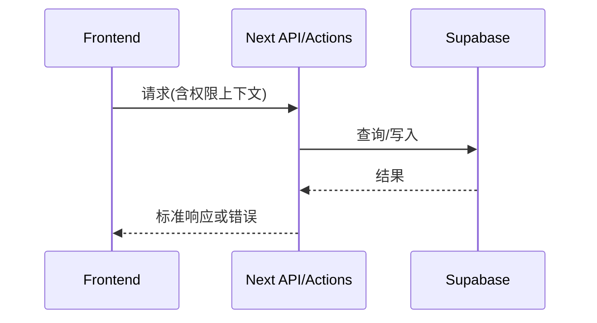

# 07 API 设计（OpenAPI 风格）

## 背景

平台 API 服务于 Web 前端与未来外部集成。

## 为什么

统一 API 规范可降低前后端协作成本并提升可测试性。

## 目标

定义请求、响应、错误、权限、分页、过滤规范。

## 非目标

- 不输出完整自动生成 SDK。

## 范围

患者、计划、任务、时间线、告警、AI、知识库核心接口。

## 流程图（Mermaid）



## ASCII 图

```text
Client -> /api/* -> AuthZ -> Service -> DB -> JSON
```

## API 规范表

| 项   | 规范                                                  |
| ---- | ----------------------------------------------------- |
| 认证 | `Authorization: Bearer <token>`                       |
| 分页 | Cursor（`next_cursor`）                               |
| 过滤 | query 参数（`status`, `risk_level`, `updated_after`） |
| 错误 | `{ code, message, request_id }`                       |

## OpenAPI 片段示例

```yaml
openapi: 3.1.0
paths:
  /api/patients:
    get:
      summary: 获取患者列表
      parameters:
        - in: query
          name: cursor
          schema: { type: string }
        - in: query
          name: risk_level
          schema: { type: string, enum: [low, medium, high] }
      responses:
        "200":
          description: OK
        "401":
          description: Unauthorized
```

## 核心端点

| 方法 | 路径                          | 权限               |
| ---- | ----------------------------- | ------------------ |
| GET  | `/api/patients`               | doctor/nurse/admin |
| POST | `/api/care-plans`             | doctor             |
| GET  | `/api/patients/{id}/timeline` | doctor/nurse       |
| POST | `/api/alerts/{id}/ack`        | doctor/nurse       |
| POST | `/api/ai/chat`                | doctor/nurse       |

## 示例

请求：

```http
GET /api/patients?risk_level=high&cursor=abc
```

响应：

```json
{
  "data": [{ "id": "p_1", "name": "张三", "risk_level": "high" }],
  "next_cursor": "def"
}
```

## 风险

| 风险       | 缓解                              |
| ---------- | --------------------------------- |
| 分页不稳定 | 使用稳定排序键（`updated_at,id`） |

## Future Work

- 增加 API 契约测试自动化与变更兼容矩阵。
