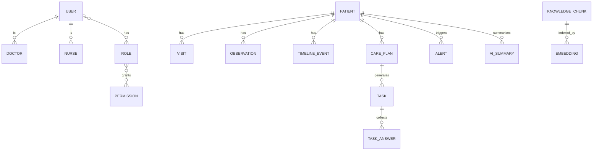

# 08 Database 设计

## 背景

数据层需同时支持事务一致性、向量检索与实时事件。

## 为什么

缺少统一数据模型会导致业务对象语义不一致。

## 目标

给出 ER 图与每张核心表字段、索引、约束、说明。

## 非目标

- 不提供具体迁移脚本实现。

## 范围

User、Patient、Doctor、Nurse、Role、Permission、Visit、Observation、TimelineEvent、CarePlan、Task、TaskAnswer、Notification、Alert、AISummary、KnowledgeChunk、Embedding。

## 流程图（Mermaid）



## ASCII 图

```text
User -> Role -> Permission
Patient -> CarePlan -> Task -> TaskAnswer
Patient -> Observation/TimelineEvent/Alert/AISummary
KnowledgeChunk -> Embedding(pgvector)
```

## 表结构（字段/索引/约束/说明）

### user

| 字段       | 类型        | 约束                   | 说明     |
| ---------- | ----------- | ---------------------- | -------- |
| id         | uuid        | PK                     | 用户 ID  |
| org_id     | uuid        | NOT NULL               | 机构 ID  |
| email      | text        | UNIQUE                 | 登录标识 |
| status     | text        | CHECK(active/disabled) | 用户状态 |
| created_at | timestamptz | NOT NULL               | 创建时间 |

索引：`idx_user_org_id`；约束：`uq_user_email`。

### doctor / nurse

| 字段       | 类型 | 约束               | 说明        |
| ---------- | ---- | ------------------ | ----------- |
| id         | uuid | PK                 | 角色实体 ID |
| user_id    | uuid | FK->user.id UNIQUE | 关联用户    |
| department | text |                    | 科室        |

索引：`idx_doctor_department`、`idx_nurse_department`。

### role / permission

| 字段           | 类型 | 约束   | 说明          |
| -------------- | ---- | ------ | ------------- |
| role.id        | uuid | PK     | 角色 ID       |
| role.key       | text | UNIQUE | 如 doctor     |
| permission.id  | uuid | PK     | 权限 ID       |
| permission.key | text | UNIQUE | 如 task.write |

中间表：`role_permissions(role_id, permission_id)`、`user_roles(user_id, role_id)`。

### patient

| 字段       | 类型 | 约束                   | 说明         |
| ---------- | ---- | ---------------------- | ------------ |
| id         | uuid | PK                     | 患者 ID      |
| org_id     | uuid | NOT NULL               | 机构 ID      |
| mrn        | text | UNIQUE                 | 院内编号     |
| risk_level | text | CHECK(low/medium/high) | 当前风险等级 |

索引：`idx_patient_org_risk(org_id,risk_level)`。

### visit

| 字段       | 类型        | 约束     | 说明        |
| ---------- | ----------- | -------- | ----------- |
| id         | uuid        | PK       | 就诊记录 ID |
| patient_id | uuid        | FK       | 患者        |
| visited_at | timestamptz | NOT NULL | 就诊时间    |
| note       | text        |          | 备注        |

索引：`idx_visit_patient_time(patient_id, visited_at desc)`。

### observation

| 字段        | 类型        | 约束     | 说明     |
| ----------- | ----------- | -------- | -------- |
| id          | uuid        | PK       | 观测 ID  |
| patient_id  | uuid        | FK       | 患者     |
| metric      | text        | NOT NULL | 指标名   |
| value       | numeric     | NOT NULL | 指标值   |
| observed_at | timestamptz | NOT NULL | 观测时间 |

索引：`idx_observation_patient_metric_time`。

### timeline_event

| 字段       | 类型        | 约束     | 说明                    |
| ---------- | ----------- | -------- | ----------------------- |
| id         | uuid        | PK       | 事件 ID                 |
| patient_id | uuid        | FK       | 患者                    |
| type       | text        | NOT NULL | task/alert/note/summary |
| payload    | jsonb       | NOT NULL | 事件内容                |
| event_at   | timestamptz | NOT NULL | 事件时间                |

索引：`idx_timeline_patient_time(patient_id,event_at desc)`。

### care_plan

| 字段       | 类型        | 约束                         | 说明     |
| ---------- | ----------- | ---------------------------- | -------- |
| id         | uuid        | PK                           | 计划 ID  |
| patient_id | uuid        | FK                           | 患者     |
| version    | int         | NOT NULL                     | 版本号   |
| status     | text        | CHECK(draft/active/archived) | 状态     |
| starts_at  | timestamptz |                              | 生效时间 |

唯一约束：`uq_care_plan_patient_version`。

### task / task_answer

| 字段                  | 类型  | 约束                                           | 说明     |
| --------------------- | ----- | ---------------------------------------------- | -------- |
| task.id               | uuid  | PK                                             | 任务 ID  |
| task.care_plan_id     | uuid  | FK                                             | 来源计划 |
| task.assignee_user_id | uuid  | FK                                             | 执行人   |
| task.status           | text  | CHECK(pending/in_progress/completed/escalated) | 状态     |
| task_answer.id        | uuid  | PK                                             | 回答 ID  |
| task_answer.task_id   | uuid  | FK                                             | 关联任务 |
| task_answer.answer    | jsonb | NOT NULL                                       | 回答内容 |

索引：`idx_task_assignee_status`、`idx_task_answer_task_id`。

### notification

| 字段     | 类型        | 约束            | 说明     |
| -------- | ----------- | --------------- | -------- |
| id       | uuid        | PK              | 通知 ID  |
| user_id  | uuid        | FK              | 接收人   |
| priority | text        | CHECK(p1/p2/p3) | 优先级   |
| read_at  | timestamptz |                 | 已读时间 |

索引：`idx_notification_user_read(user_id,read_at)`。

### alert

| 字段         | 类型        | 约束                   | 说明     |
| ------------ | ----------- | ---------------------- | -------- |
| id           | uuid        | PK                     | 告警 ID  |
| patient_id   | uuid        | FK                     | 患者     |
| severity     | text        | CHECK(p1/p2/p3)        | 严重级别 |
| status       | text        | CHECK(open/ack/closed) | 状态     |
| triggered_at | timestamptz | NOT NULL               | 触发时间 |

索引：`idx_alert_patient_status`、`idx_alert_severity_status`。

### ai_summary

| 字段         | 类型 | 约束     | 说明               |
| ------------ | ---- | -------- | ------------------ |
| id           | uuid | PK       | 摘要 ID            |
| patient_id   | uuid | FK       | 患者               |
| summary_type | text | NOT NULL | doctor_brief/daily |
| content      | text | NOT NULL | 摘要内容           |
| model        | text | NOT NULL | 模型标识           |

索引：`idx_ai_summary_patient_created`。

### knowledge_chunk / embedding

| 字段                    | 类型         | 约束      | 说明          |
| ----------------------- | ------------ | --------- | ------------- |
| knowledge_chunk.id      | uuid         | PK        | 分片 ID       |
| knowledge_chunk.doc_id  | uuid         | NOT NULL  | 文档 ID       |
| knowledge_chunk.content | text         | NOT NULL  | 分片文本      |
| embedding.id            | uuid         | PK        | 向量 ID       |
| embedding.chunk_id      | uuid         | FK UNIQUE | 分片映射      |
| embedding.vector        | vector(1536) | NOT NULL  | pgvector 向量 |

索引：`ivfflat (vector)`；约束：`fk_embedding_chunk`。

## 示例

查询最近 7 天高风险患者的时间线事件，使用 `patient.risk_level + timeline_event.event_at` 复合索引组合。

## 风险

| 风险             | 缓解                       |
| ---------------- | -------------------------- |
| 索引过多影响写入 | 基于慢查询与读写比迭代索引 |
| RLS 性能下降     | 常用策略字段建立前缀索引   |

## Future Work

- 增加审计日志与 outbox 事件表。
- 引入分区表（按时间/机构）支持大规模数据。
