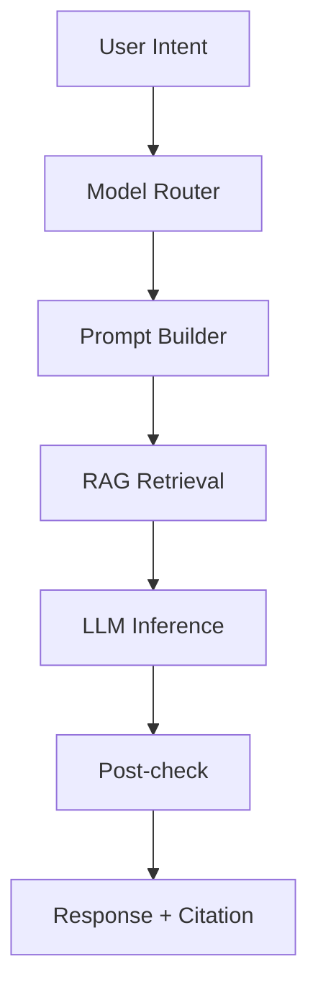

# 09 AI 设计

## 背景
平台需在医疗场景下安全使用多模型与 RAG。

## 为什么
AI 输出必须可追溯、可评估、可治理。

## 目标
定义 AI Architecture、Prompt Strategy、Model Router、Agent/Workflow、RAG、Embedding/Chunk/Retrieval、Memory、Evaluation、Hallucination 防控。

## 非目标
- 不训练基础大模型。

## 范围
Doctor Brief、AI Chat、Follow-up 文案辅助。

## 流程图（Mermaid）


## ASCII 图
```text
Intent -> Router -> Prompt -> Retrieve -> Generate -> Validate -> Output
```

## 架构表
| 模块 | 设计要点 |
|---|---|
| Prompt Strategy | 模板化 + 变量白名单 + 版本化 |
| Model Router | 按任务类型/延迟/成本路由 |
| Agent Workflow | 仅限受控工具调用与可审计动作 |
| RAG | chunk->embedding->retrieval->rerank->citation |
| Memory | 会话级短期记忆 + 患者上下文隔离 |
| Evaluation | 离线集 + 在线采纳率与纠错率 |
| Hallucination | 强制引用、低置信度降级、拒答策略 |

## Chunk / Embedding / Retrieval 策略
| 主题 | 方案 |
|---|---|
| Chunk | 300-800 tokens，保留标题与段落层级 |
| Embedding | 统一向量维度（如 1536） |
| Retrieval | TopK 召回 + MMR 去冗余 + 重排 |

## 示例
医生提问“患者近 7 天最值得关注的变化”，系统调用 Timeline 检索 + 知识库检索，输出带引用的简要结论与行动建议。

## 风险
| 风险 | 缓解 |
|---|---|
| 幻觉导致误导 | 引用不足即拒答/降级 |
| 模型漂移 | 每周基准集回归评测 |
| 提示注入 | 输入净化 + 指令分层 |

## Future Work
- 增加病种专用评测集与自动回归门禁。
- 引入人机协同反馈闭环优化 Prompt。

