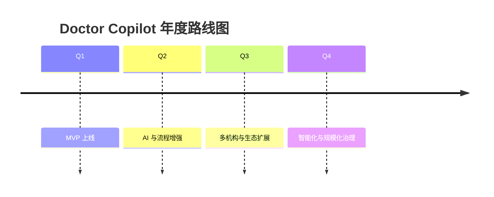

# 10 一年 Roadmap

## 背景
MVP 上线后需规划连续 12 个月的能力演进。

## 为什么
Roadmap 帮助业务与研发对齐投资节奏与技术债治理。

## 目标
提供季度目标、关键交付与风险控制。

## 非目标
- 不做人力编制与预算明细。

## 范围
Q1~Q4 功能与平台能力规划。

## 流程图（Mermaid）


## ASCII 图
```text
Q1 MVP -> Q2 Optimize -> Q3 Scale -> Q4 Intelligence
```

## 表格
| 季度 | 重点目标 | 关键交付 |
|---|---|---|
| Q1 | MVP 可用 | 核心闭环上线、验收达标 |
| Q2 | 质量提升 | Prompt 管理、评测体系、告警优化 |
| Q3 | 规模化 | 多租户增强、外部系统集成 API |
| Q4 | 智能化 | Agent 工作流、预测模型、运营看板 |

## 示例
Q2 将“高风险告警响应率”目标从 80% 提升到 90%，并通过自动化提醒策略支撑。

## 风险
| 风险 | 缓解 |
|---|---|
| 范围增长快于产能 | 季度重新分级优先级 |
| 技术债累积 | 每季度预留治理容量 |

## Future Work
- 制定按机构类型（公立/私立）的差异化路线图。

