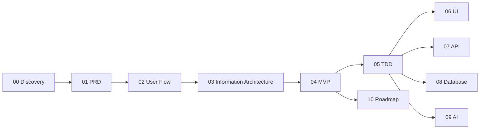

# Doctor Copilot 文档中心

## 背景
Doctor Copilot 是面向院外连续医疗照护场景的 AI Care Platform，服务医生、护士、患者与管理员四类角色。

## 为什么
当前仓库缺少可直接用于研发协作的系统化文档，难以支撑跨角色、跨模块并行开发。

## 目标
- 提供企业级开源文档结构，支持产品、研发、测试、运维协同。
- 支持直接发布到 Docusaurus 或 VitePress。

## 非目标
- 不提供营销型介绍。
- 不替代代码内注释与自动生成 API SDK 文档。

## 范围
覆盖 discovery、prd、user-flow、information architecture、mvp、tdd、ui、api、database、ai、roadmap。

## 流程图（Mermaid）


## ASCII 图
```text
docs/
├── 00-discovery
├── 01-prd
├── 02-user-flow
├── 03-information-architecture
├── 04-mvp
├── 05-tdd
├── 06-ui
├── 07-api
├── 08-database
├── 09-ai
└── 10-roadmap
```

## 文档目录
| 模块 | 入口 |
|---|---|
| Discovery | [00-discovery/README.md](./00-discovery/README.md) |
| PRD | [01-prd/README.md](./01-prd/README.md) |
| User Flow | [02-user-flow/README.md](./02-user-flow/README.md) |
| Information Architecture | [03-information-architecture/README.md](./03-information-architecture/README.md) |
| MVP | [04-mvp/README.md](./04-mvp/README.md) |
| TDD | [05-tdd/README.md](./05-tdd/README.md) |
| UI | [06-ui/README.md](./06-ui/README.md) |
| API | [07-api/README.md](./07-api/README.md) |
| Database | [08-database/README.md](./08-database/README.md) |
| AI | [09-ai/README.md](./09-ai/README.md) |
| Roadmap | [10-roadmap/README.md](./10-roadmap/README.md) |

## 示例
例如实现“AI Follow-up”能力时，建议按以下顺序阅读：
1. [00-discovery/mvp-scope.md](./00-discovery/mvp-scope.md)
2. [01-prd/06-follow-up.md](./01-prd/06-follow-up.md)
3. [05-tdd/README.md](./05-tdd/README.md)
4. [07-api/README.md](./07-api/README.md)
5. [08-database/README.md](./08-database/README.md)

## 风险
| 风险 | 影响 | 缓解 |
|---|---|---|
| 文档与实现偏离 | 需求误解 | 每个迭代按 PR 更新文档 |
| 跨文档术语不一致 | 沟通成本上升 | 统一术语表并在 PR 审查校对 |

## Future Work
- 补充 ADR（Architecture Decision Records）目录。
- 增加变更日志（Docs Changelog）与版本标签策略。

